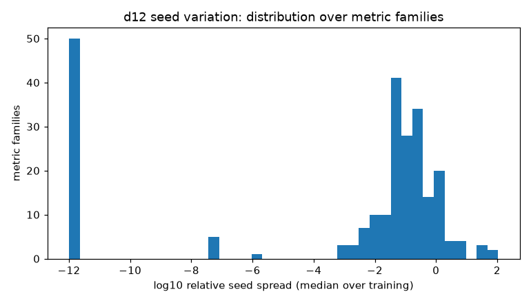

## Result

The five runs share an identical step grid (2,520 steps, periodic every 101,
30 deep checkpoints), so all comparisons are point-by-point with no
interpolation.

**Seed spread is not one number. It ranges over five orders of magnitude.**
The median family varies by 6.0% between seeds. 72 families vary by less than
1%; 42 vary by more than 50%.

By tier, the median relative spread is 0.0% for continuous, 5.1% for
periodic, 13.3% for sparse. The continuous tier is low because many of its
channels are configuration values, not measurements.

### Channels that can detect a change

| family | channels | relative seed spread |
|---|---|---|
| `loss/train_mean` | 1 | 0.06% |
| `probe/loss` | 2 | 0.16% |
| `param/norm` | 113 | 1.0% |
| `muon/replay_update_relerr` | 78 | 3.5% |
| `muon/cos_raw_final` | 78 | 7.3% |

Loss channels are the strongest detectors in the dataset by a wide margin: a
change that moves train loss by more than about 0.2% is visible above seed
noise with five runs. The Muon decoherence metric is also tight (3.5%), which
matters because it is one of the more novel quantities here.

### Channels too noisy to be useful

| family | channels | relative seed spread |
|---|---|---|
| `curvature/c_fd_random` | 1 | 10,780% |
| `curvature/curv_floor_random` | 1 | 4,280% |
| `probe/block_in_stats_mean` | 24 | 466% |
| `update/p2` (both arms) | 1 | 79% (142% late) |
| `optim/adamw_m_rms` | 35 | 65% |

The worst offenders are the acceptance suite's own noise-floor diagnostics
(`c_fd_*`, `curv_floor_*`, `fd_floor_*`). Those quantities measure numerical
noise, so it is unsurprising that they are themselves noisy; they are
instrument diagnostics, not observables.

### The curvature channels sit in the middle, and that is the operational finding

| family | spread (native) | spread (shadow fp32) |
|---|---|---|
| `curvature/dhd` | 13.1% | 13.1% |
| `curvature/eta_star` | 24.9% | 25.9% |
| `curvature/gHg` | 29.6% | 29.2% |

A cross-depth or intervention claim about curvature needs an effect well
above roughly 25-30% to survive seed noise at n=5. The trajectory changes we
have seen across training are much larger than that, but a subtle effect
would not be detectable with five runs.

The two acceptance arms have nearly identical seed spread (29.6% vs 29.2% for
gHg). Seed variation dominates the difference between bf16 and IEEE fp32
arithmetic for these quantities.

### Gradient noise scale

`noise/s2` varies by 13.6% and `noise/b_noise` by 26.2% between seeds. Any
claim about the noise scale needs a large effect, and see caveat 8 in
`DATASET.md`: this quantity is measured on a device batch, not on the logical
batch that drives the update.

### Early versus late

Median relative spread is 7.5% before step 400 and 6.2% after. Seeds diverge
slightly more during the warmup window, as expected, but the effect is small
compared with the spread between channels.

### Sanity check

Configuration channels (`optim/lr`, `optim/beta1`, `optim/beta2`,
`batch/bos_count`, `mem/alloc_start_bytes`) have exactly zero spread across
all five runs. These are deterministic given the recipe, so zero is the
correct answer and the pipeline reproduces it.

## Limitations

**Two deviations from the frozen protocol, both disclosed.**

1. The protocol's selection line said curvature would be "restricted to
   per-direction passing verdicts". I did not apply that filter. Applied
   literally it would remove every arm-level curvature channel
   (`gHg`, `eta_star`, `dhd`), because no checkpoint-level verdict passes in
   any run, and it would change the population being measured: the question
   asks how much a channel varies between seeds, which is a property of the
   channel and not of its certification status. The spread figures above are
   therefore over all defined values. A follow-up restricted to passing
   gradient-direction records would be a different and also useful number.
2. I added one statistic beyond the protocol, `noise_vs_swing`: seed noise
   relative to how much a channel moves over training. It is in
   `channels.csv` and `families.csv` but I did not rank by it. The ranking
   follows the protocol's definition.

**Sixty-nine vector-valued families were not analysed**, including all
`sketch/*` families and the acceptance sweeps (`curvature/*_sweep_*`). A
scalar spread is not defined for them without first choosing a summary, and
that choice is an analytical decision the protocol did not authorize. They
are listed in `summary.json`.

**Five runs is a small sample.** The standard deviation of five values is
itself uncertain by roughly ±50%, so these spreads should be read as order
of magnitude, not as precise error bars.

**Probe-based families carry probe sampling variance**, because probes are
drawn per seed. This affects `probe/*`, all `curvature/*`, and `update/*`.
Their spread is therefore an upper bound on the trajectory variance alone.

**This reference is d12 only.** Caveats 1 and 3 in `DATASET.md` apply: depth
covaries with width, batch size and learning rate, and the warmup windows are
a fixed number of steps, so d12 spread need not transfer to d14 or d16.

**Relative spread is undefined where the median is near zero.** Eleven
families have no defined relative spread for this reason and are reported as
such rather than dropped.
