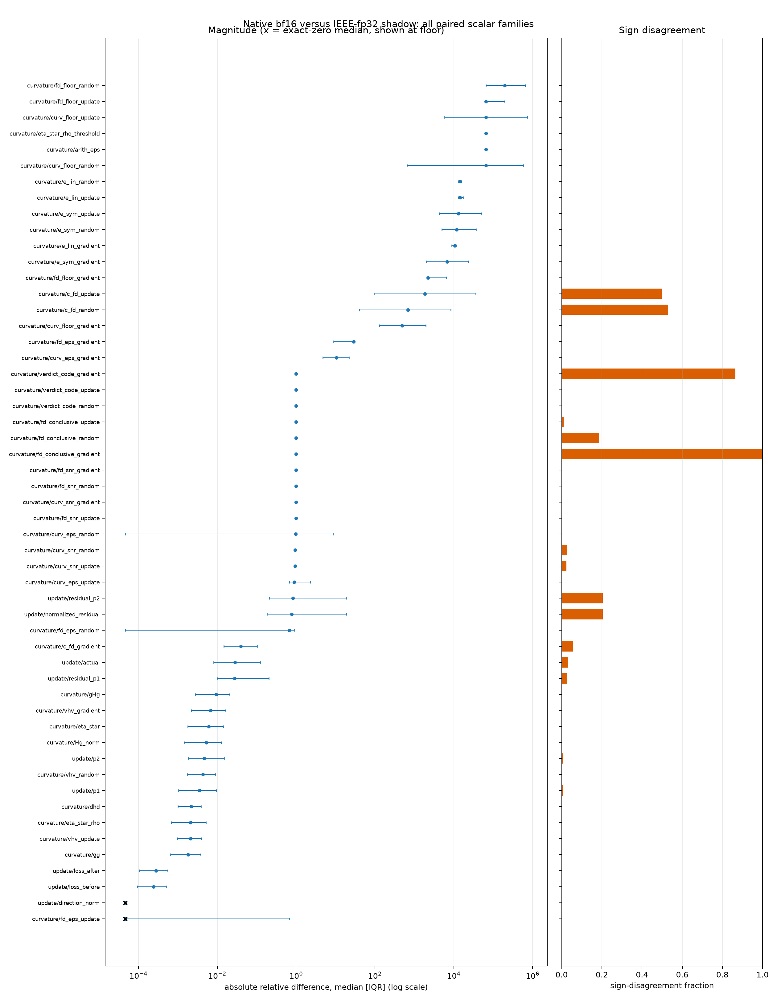
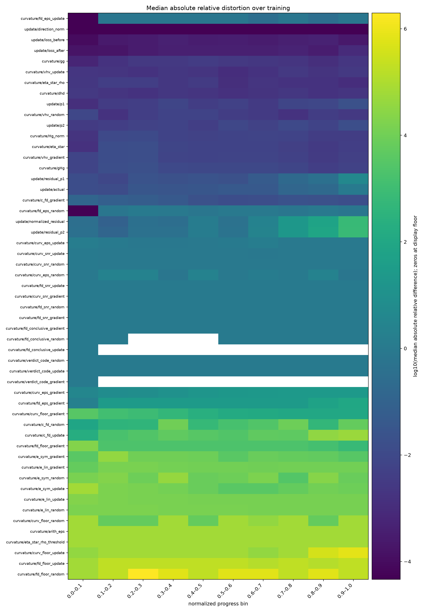
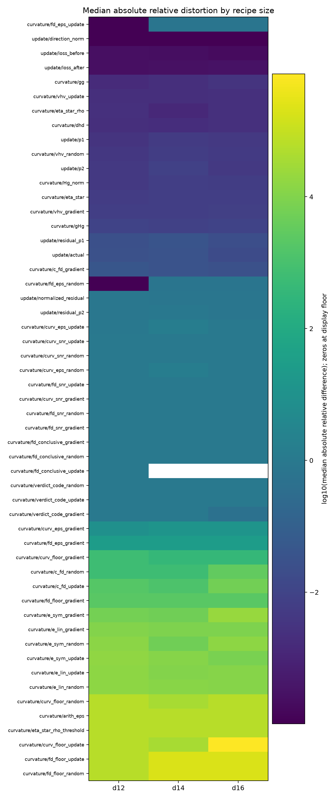

## Result

The paired result supports a strongly metric-dependent answer, not a single
bf16 error rate. Direct HVP curvature scalars differ from the fp32 shadow by
typically **0.21%–0.94%** and never disagree in sign. The bf16 finite-difference
estimate is much less reliable: the gradient direction differs by a typical
**3.94%**, while the near-null random and update directions differ by hundreds
to thousands of times the shadow value and disagree in sign at about half of
the checkpoints. Acceptance floors, tolerances, SNRs, and verdicts differ even
more because they explicitly expose the arithmetic precision gap.

There were 215 deep checkpoints (5×30 d12 + 32 d14 + 33 d16). Every family
has 215 pairs except `curvature/eta_star`, which is defined in both arms at 186.
All 215 checkpoint-level native verdicts are failed (code 2). As required by
the protocol, I did **not** condition on verdicts: doing so would empty the
native comparison.

### Headline distribution

Across all 11,366 pair-metric observations, the signed relative difference
has median **+0.003497** (+0.350%) and IQR **[-0.01431, 1523.83]**. The absolute
relative difference has median **0.99889** (99.9%) and IQR
**[0.006538, 2200.03]**. The median of the 53 family medians is similarly
0.99836. This pooled number is real but is not representative of the direct
curvature values: it mixes sub-percent HVP values with bf16-vs-fp32 arithmetic
constants and acceptance diagnostics whose fp32 denominator is tiny. The
per-family distribution below is the substantive result.

For the direct HVP quantities:

| metric | median absolute relative difference [IQR] | median signed difference | sign disagreements |
|---|---:|---:|---:|
| `curvature/Hg_norm` | 0.524% [0.144%, 1.276%] | -0.0345% | 0/215 |
| `curvature/gHg` | 0.935% [0.276%, 2.075%] | +0.112% | 0/215 |
| `curvature/dhd` | 0.219% [0.0995%, 0.388%] | -0.0061% | 0/215 |
| `curvature/vhv_gradient` | 0.673% [0.216%, 1.649%] | +0.0514% | 0/215 |
| `curvature/vhv_random` | 0.435% [0.171%, 0.908%] | -0.104% | 0/215 |
| `curvature/vhv_update` | 0.208% [0.0975%, 0.392%] | -0.0155% | 0/215 |

The paired finite-difference estimates tell a different story:

- `curvature/c_fd_gradient`: median absolute relative difference 0.0394
  (3.94%), IQR [0.0148, 0.103], and 12/215 (5.58%) sign disagreements.
- `curvature/c_fd_random`: median 688×, IQR [40.2×, 8464×], and 114/215
  (53.0%) sign disagreements. The shadow's median absolute value is only
  0.00358, versus a native median absolute value of 1.80; the median raw
  absolute difference is 1.81.
- `curvature/c_fd_update`: median 1854×, IQR [97.7×, 36,080×], and 107/215
  (49.8%) sign disagreements. The corresponding medians are 0.000662 in the
  shadow, 2.50 native, and 2.50 raw absolute difference.

`curvature/arith_eps` and `curvature/eta_star_rho_threshold` each have a
constant 65,535× relative difference, directly reflecting the bf16/fp32
precision ratio used by the arm-specific acceptance calculation. The
linearity/symmetry error and floor families consequently span roughly
hundreds to hundreds of thousands times their fp32 values. These diagnostics
explain why the native arm is uncertified; they should not be substituted for
the direct HVP curvature values.

For update families, `update/actual` has median absolute relative difference
2.80% [0.811%, 12.2%] and 7/215 (3.26%) sign disagreements. `update/p1` and
`update/p2` are 0.351% and 0.461%; loss before/after is only 0.0242%/0.0281%.
The normalized and p2 residuals are much less stable (77.9% and 83.7% median;
44/215 sign disagreements each).

### Sign disagreements

There are 790 sign disagreements among all 11,366 pairs (6.95%), across 15 of
53 families. This aggregate includes nonnegative flags and categorical verdict
codes, where “sign disagreement” means zero versus positive rather than a
positive/negative reversal: `fd_conclusive_gradient` differs at 215/215 and
`verdict_code_gradient` at 186/215. For signed curvature values, the important
contrast is zero disagreements for all direct HVP scalars versus 5.58%, 53.0%,
and 49.8% for finite-difference gradient, random, and update curvature.

### Change over training

There is **no family-wide tendency for distortion magnitude to grow with
training**. For each metric and run, I computed Spearman correlation between
absolute relative difference and `normalized_progress`, then took the median
across the seven runs. Of 47 families with a nonconstant within-run trend, 25
have a positive median correlation, 21 negative, and one zero; the median
correlation across families is **0.0091**. Comparing run-level medians in the
first and last progress quartiles gives 22 increases and 22 decreases (the
remainder are equal or unavailable).

The absence of an aggregate trend masks channel-specific changes:

- Direct `vhv_gradient`, `vhv_random`, and `vhv_update` distortions do not
  grow: median early-to-late magnitudes are 1.15%→0.587%, 0.610%→0.318%, and
  0.235%→0.222%, with median within-run Spearman correlations -0.173, -0.135,
  and -0.120. `gHg` likewise falls 1.15%→0.422%. `Hg_norm` is the exception,
  rising 0.351%→0.501% (rho +0.137).
- Finite-difference curvature is direction-dependent. Gradient distortion
  falls 10.8%→1.55% (rho -0.678), but random rises 228×→3058× (13.4-fold;
  rho +0.314) and update rises 745×→19,687× (26.4-fold; rho +0.440).
- `update/actual` rises from 1.26% to 34.5% (27.3-fold; rho +0.659), and the
  residual families grow still more. Thus individual update diagnostics do
  worsen even though the prespecified universe does not move uniformly.

All per-run correlations and early/late values are in
[`training_trend_by_run.csv`](training_trend_by_run.csv) and
[`training_trend_summary.csv`](training_trend_summary.csv).

### Change with depth / recipe size

There is also **no consistent growth over the d12→d14→d16 size ray**. Of the
53 family medians, 26 are higher at d16 than d12, 18 lower, and 9 equal or
unavailable; only 6 increase strictly at both transitions, while 7 decrease
strictly. Among 49 finite d16/d12 ratios, the median ratio is **1.000**.

The direct HVP values are modestly higher at d16 than d12:
`vhv_gradient` 1.120×, `vhv_random` 1.225×, `vhv_update` 1.101×, `gHg` 1.015×,
`dhd` 1.085×, and `Hg_norm` 1.416×. Only `vhv_gradient` and `vhv_update` rise
strictly through all three depths; the others are nonmonotonic at d14. The
fragile finite-difference directions again diverge: random is 4.79× and update
3.05× their d12 distortion at d16, while gradient falls to 0.666×. Random and
update finite-difference distortion, `Hg_norm`, and `gHg` at d16 all exceed
the corresponding median in every one of the five d12 seeds. In total, 13
families do so.

Per-run and per-depth values are in [`depth_by_run.csv`](depth_by_run.csv) and
[`depth_summary.csv`](depth_summary.csv).

### Every paired scalar family

Relative columns are dimensionless ratios (1 = 100%). “Pairs / relative”
shows all same-state arm pairs followed by pairs with a nonzero fp32 shadow,
for which the relative formula exists. I added no denominator epsilon. Raw
absolute differences retain all pairs but are metric-unit-specific and cannot
be compared across rows.

| metric | pairs / relative | signed relative median [IQR] | absolute relative median [IQR] | absolute difference median [IQR] | sign disagreement |
|---|---:|---:|---:|---:|---:|
| `curvature/Hg_norm` | 215 / 215 | -3.448e-04 [-0.006087, 0.004422] | 0.005243 [0.001442, 0.01276] | 0.1225 [0.01469, 0.395] | 0/215 (0.0%) |
| `curvature/arith_eps` | 215 / 215 | 6.554e+04 [6.554e+04, 6.554e+04] | 6.554e+04 [6.554e+04, 6.554e+04] | 0.007812 [0.007812, 0.007812] | 0/215 (0.0%) |
| `curvature/c_fd_gradient` | 215 / 215 | -0.01017 [-0.05071, 0.02543] | 0.0394 [0.01479, 0.1034] | 0.1497 [0.04754, 0.2538] | 12/215 (5.6%) |
| `curvature/c_fd_random` | 215 / 209 | -1.563 [-1243, 497.8] | 688.2 [40.23, 8464] | 1.811 [0.204, 23.12] | 114/215 (53.0%) |
| `curvature/c_fd_update` | 215 / 210 | -3.455 [-2195, 1397] | 1854 [97.73, 3.608e+04] | 2.499 [0.1829, 19.34] | 107/215 (49.8%) |
| `curvature/curv_eps_gradient` | 215 / 215 | 10.62 [4.774, 21.95] | 10.62 [4.774, 21.95] | 0.0914 [0.08268, 0.09562] | 0/215 (0.0%) |
| `curvature/curv_eps_random` | 215 / 215 | 0 [-0.6667, 9] | 0.97 [0, 9] | 0.027 [0, 0.09] | 0/215 (0.0%) |
| `curvature/curv_eps_update` | 215 / 215 | 0 [-0.7, 2.333] | 0.9 [0.6667, 2.333] | 0.027 [0.007, 0.09] | 0/215 (0.0%) |
| `curvature/curv_floor_gradient` | 215 / 215 | 486.6 [127.8, 1967] | 486.6 [127.8, 1967] | 5.976 [4.957, 14.44] | 0/215 (0.0%) |
| `curvature/curv_floor_random` | 215 / 215 | 6.552e+04 [654.8, 5.899e+05] | 6.552e+04 [654.8, 5.899e+05] | 168.3 [16.86, 2742] | 0/215 (0.0%) |
| `curvature/curv_floor_update` | 215 / 215 | 6.554e+04 [5893, 7.282e+05] | 6.554e+04 [5893, 7.282e+05] | 73.8 [31.94, 715.1] | 0/215 (0.0%) |
| `curvature/curv_snr_gradient` | 215 / 215 | -0.9984 [-0.9994, -0.9931] | 0.9984 [0.9931, 0.9994] | 279.3 [257.5, 300.9] | 0/215 (0.0%) |
| `curvature/curv_snr_random` | 215 / 209 | -0.945 [-0.9783, -0.9115] | 0.945 [0.9115, 0.9783] | 0.4153 [0.2596, 0.5675] | 6/215 (2.8%) |
| `curvature/curv_snr_update` | 215 / 210 | -0.9447 [-0.9804, -0.8948] | 0.9447 [0.8948, 0.9804] | 0.3694 [0.2096, 0.5327] | 5/215 (2.3%) |
| `curvature/dhd` | 215 / 215 | -6.133e-05 [-0.001957, 0.002556] | 0.002188 [9.953e-04, 0.003875] | 9.840e-05 [2.035e-05, 3.025e-04] | 0/215 (0.0%) |
| `curvature/e_lin_gradient` | 215 / 215 | 1.059e+04 [8894, 1.188e+04] | 1.059e+04 [8894, 1.188e+04] | 0.005417 [0.004512, 0.007041] | 0/215 (0.0%) |
| `curvature/e_lin_random` | 215 / 215 | 1.447e+04 [1.325e+04, 1.546e+04] | 1.447e+04 [1.325e+04, 1.546e+04] | 0.01129 [0.01059, 0.01185] | 0/215 (0.0%) |
| `curvature/e_lin_update` | 215 / 215 | 1.446e+04 [1.292e+04, 1.746e+04] | 1.446e+04 [1.292e+04, 1.746e+04] | 0.01079 [0.009713, 0.0119] | 0/215 (0.0%) |
| `curvature/e_sym_gradient` | 215 / 215 | 6834 [2013, 2.362e+04] | 6834 [2013, 2.362e+04] | 0.007484 [0.003186, 0.01665] | 0/215 (0.0%) |
| `curvature/e_sym_random` | 215 / 215 | 1.186e+04 [4957, 3.693e+04] | 1.186e+04 [4957, 3.693e+04] | 0.01225 [0.00471, 0.02537] | 0/215 (0.0%) |
| `curvature/e_sym_update` | 215 / 215 | 1.314e+04 [4347, 5.113e+04] | 1.314e+04 [4347, 5.113e+04] | 0.0136 [0.005374, 0.03139] | 0/215 (0.0%) |
| `curvature/eta_star` | 186 / 186 | 1.879e-04 [-0.006605, 0.005868] | 0.006052 [0.001784, 0.01425] | 8.209e-04 [3.489e-04, 0.002708] | 0/186 (0.0%) |
| `curvature/eta_star_rho` | 215 / 215 | 3.345e-04 [-0.001218, 0.00309] | 0.002106 [6.840e-04, 0.005145] | 8.135e-04 [2.654e-04, 0.001993] | 0/215 (0.0%) |
| `curvature/eta_star_rho_threshold` | 215 / 215 | 6.554e+04 [6.554e+04, 6.554e+04] | 6.554e+04 [6.554e+04, 6.554e+04] | 0.0625 [0.0625, 0.0625] | 0/215 (0.0%) |
| `curvature/fd_conclusive_gradient` | 215 / 215 | -1 [-1, -1] | 1 [1, 1] | 1 [1, 1] | 215/215 (100.0%) |
| `curvature/fd_conclusive_random` | 215 / 40 | -1 [-1, -1] | 1 [1, 1] | 0 [0, 0] | 40/215 (18.6%) |
| `curvature/fd_conclusive_update` | 215 / 2 | -1 [-1, -1] | 1 [1, 1] | 0 [0, 0] | 2/215 (0.9%) |
| `curvature/fd_eps_gradient` | 215 / 215 | 29 [9, 29] | 29 [9, 29] | 0.029 [0.027, 0.029] | 0/215 (0.0%) |
| `curvature/fd_eps_random` | 215 / 215 | -0.6667 [-0.9, 0] | 0.6667 [0, 0.9] | 0.02 [0, 0.027] | 0/215 (0.0%) |
| `curvature/fd_eps_update` | 215 / 215 | 0 [-0.6667, 0] | 0 [0, 0.6667] | 0 [0, 0.02] | 0/215 (0.0%) |
| `curvature/fd_floor_gradient` | 215 / 215 | 2203 [2185, 6557] | 2203 [2185, 6557] | 0.6091 [0.5262, 0.8811] | 0/215 (0.0%) |
| `curvature/fd_floor_random` | 215 / 215 | 1.959e+05 [6.553e+04, 6.559e+05] | 1.959e+05 [6.553e+04, 6.559e+05] | 1.492 [0.556, 8.884] | 0/215 (0.0%) |
| `curvature/fd_floor_update` | 215 / 215 | 6.614e+04 [6.553e+04, 1.969e+05] | 6.614e+04 [6.553e+04, 1.969e+05] | 1.294 [0.5635, 2.709] | 0/215 (0.0%) |
| `curvature/fd_snr_gradient` | 215 / 215 | -0.9995 [-0.9998, -0.9995] | 0.9995 [0.9995, 0.9998] | 3.727e+04 [1.905e+04, 5.543e+04] | 0/215 (0.0%) |
| `curvature/fd_snr_random` | 215 / 215 | -0.9988 [-0.9992, -0.9986] | 0.9988 [0.9986, 0.9992] | 605.8 [434.5, 746.5] | 0/215 (0.0%) |
| `curvature/fd_snr_update` | 215 / 215 | -0.9939 [-0.9979, -0.9922] | 0.9939 [0.9922, 0.9979] | 123 [96.41, 145.4] | 0/215 (0.0%) |
| `curvature/gHg` | 215 / 215 | 0.001123 [-0.006503, 0.01429] | 0.009351 [0.002763, 0.02075] | 0.208 [0.02363, 0.8319] | 0/215 (0.0%) |
| `curvature/gg` | 215 / 215 | -9.271e-05 [-0.002018, 0.001566] | 0.001812 [6.492e-04, 0.003806] | 0.01219 [0.003413, 0.03055] | 0/215 (0.0%) |
| `curvature/verdict_code_gradient` | 215 / 29 | 1 [1, 1] | 1 [1, 1] | 2 [2, 2] | 186/215 (86.5%) |
| `curvature/verdict_code_random` | 215 / 215 | 1 [1, 1] | 1 [1, 1] | 1 [1, 1] | 0/215 (0.0%) |
| `curvature/verdict_code_update` | 215 / 215 | 1 [1, 1] | 1 [1, 1] | 1 [1, 1] | 0/215 (0.0%) |
| `curvature/vhv_gradient` | 215 / 215 | 5.143e-04 [-0.005682, 0.01136] | 0.006732 [0.002164, 0.01649] | 0.02724 [0.003914, 0.06996] | 0/215 (0.0%) |
| `curvature/vhv_random` | 215 / 215 | -0.001038 [-0.004981, 0.003285] | 0.004347 [0.001706, 0.009076] | 1.908e-08 [6.972e-09, 4.108e-08] | 0/215 (0.0%) |
| `curvature/vhv_update` | 215 / 215 | -1.549e-04 [-0.001913, 0.002526] | 0.002084 [9.746e-04, 0.003922] | 3.722e-10 [1.710e-10, 8.312e-10] | 0/215 (0.0%) |
| `update/actual` | 215 / 215 | 0.002985 [-0.02738, 0.02862] | 0.02804 [0.008108, 0.1221] | 9.441e-04 [4.097e-04, 0.001704] | 7/215 (3.3%) |
| `update/direction_norm` | 215 / 215 | 0 [0, 0] | 0 [0, 0] | 0 [0, 0] | 0/215 (0.0%) |
| `update/loss_after` | 215 / 215 | 5.678e-05 [-2.029e-04, 3.167e-04] | 2.808e-04 [1.060e-04, 5.566e-04] | 6.905e-04 [3.304e-04, 0.001146] | 0/215 (0.0%) |
| `update/loss_before` | 215 / 215 | 1.182e-05 [-1.911e-04, 2.898e-04] | 2.417e-04 [9.259e-05, 5.093e-04] | 5.846e-04 [2.478e-04, 0.001007] | 0/215 (0.0%) |
| `update/normalized_residual` | 215 / 215 | 0.02151 [-0.5226, 1.753] | 0.779 [0.19, 18.79] | 0.02142 [0.00647, 0.0909] | 44/215 (20.5%) |
| `update/p1` | 215 / 215 | 3.296e-05 [-0.003475, 0.003518] | 0.003514 [0.001047, 0.009568] | 1.183e-04 [3.947e-05, 3.142e-04] | 1/215 (0.5%) |
| `update/p2` | 215 / 215 | -1.507e-04 [-0.00483, 0.004445] | 0.004607 [0.001837, 0.01484] | 1.136e-04 [3.966e-05, 3.051e-04] | 1/215 (0.5%) |
| `update/residual_p1` | 215 / 215 | 0.00396 [-0.02224, 0.03734] | 0.02774 [0.009884, 0.2055] | 9.352e-04 [4.031e-04, 0.001581] | 6/215 (2.8%) |
| `update/residual_p2` | 215 / 215 | 0.02941 [-0.5242, 1.828] | 0.8371 [0.2118, 19.04] | 8.858e-04 [3.954e-04, 0.001494] | 44/215 (20.5%) |

The machine-readable source for this table, including shadow-zero and exact-
agreement counts, is [`metric_summary.csv`](metric_summary.csv). Exact paired
values are in [`paired_values.csv`](paired_values.csv).

### Seed spread

No unpaired I0001 error bar is needed for the arm contrast: native and shadow
measure the same parameters at the same checkpoint, so trajectory seed
variation cancels pair by pair. The five d12 runs still provide a sensitivity
check for the descriptive size-ray comparison. Thirteen d16 family medians
exceed every d12-seed run median; the examples relevant to direct/finite-
difference curvature are `Hg_norm`, `gHg`, `c_fd_random`, and `c_fd_update`.
This does not turn the size-ray comparison into a controlled depth effect.

## Limitations

- **Relative denominators:** 596/11,366 shadow values are exactly zero. Their
  relative differences are undefined and omitted without adding an epsilon;
  their raw absolute differences and sign comparisons remain. Near-zero but
  nonzero shadow finite differences produce very large valid ratios, so raw
  differences are reported alongside them.
- **Curvature scope and native certification (data-card caveats 4 and 6):**
  all HVP quantities are local to one 256-token sequence, and all native
  checkpoint verdicts fail. This analysis deliberately describes disagreement
  with the paired fp32 reference; it does not claim the native curvature is
  certified.
  Flags and verdict codes are categorical even though the frozen universe
  requires treating every shared scalar family numerically.
- **Trend rule was underspecified:** the protocol required comparison against
  `normalized_progress` and depth but did not freeze a statistic. I chose
  within-run Spearman correlation of absolute relative magnitude, median
  across runs, plus first/last-progress-quartile medians. Depth summaries use
  a separate median within each depth. These are descriptive: repeated
  checkpoints are autocorrelated, no inferential threshold was prespecified,
  and no confidence interval or p-value is claimed.
- **Size ray and n=3 (caveats 1–3):** d12/d14/d16 jointly change width, heads,
  batch size, LR, weight decay, and horizon. Only d12 has five seeds; d14 and
  d16 have one each. The absolute 40-step LR and 400-step Muon warmups occupy
  different normalized fractions. “With depth” here means along this recipe
  size ray, not that depth causes the change.
- **Probe scope and execution (caveats 7–8):** all seven runs share the same
  probes, so probe selection adds no variance to these comparisons, though the
  result remains local to those samples. Compiled-GPU nondeterminism affects
  which model states were reached. Same-state arm pairing removes it from the
  immediate arithmetic contrast, but not from generalization of progress or
  size-ray patterns.
- **Muon reference and noise-scale caveats (5 and 9):** no `muon/*` or
  gradient-noise-scale family was tested. The update direction is the actual
  applied update, so no claim about an eager Muon reference decomposition or
  critical batch size is made.
- **Multiple comparisons (caveat 10):** all 53 shared scalar families were
  prespecified and all are reported, avoiding outcome selection. The
  distinction between direct HVP values, finite differences, and acceptance
  diagnostics is an interpretive subgrouping; channel-specific trend and
  depth narratives should be confirmed on new runs.
