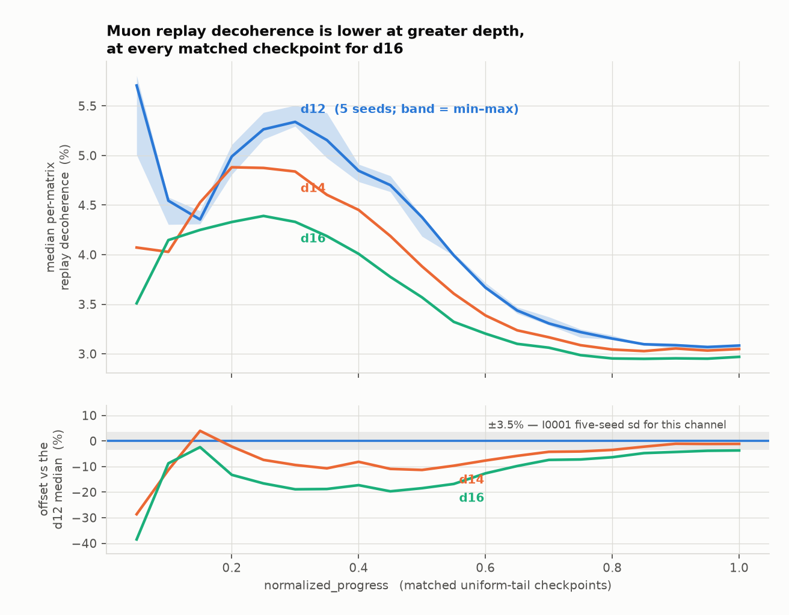
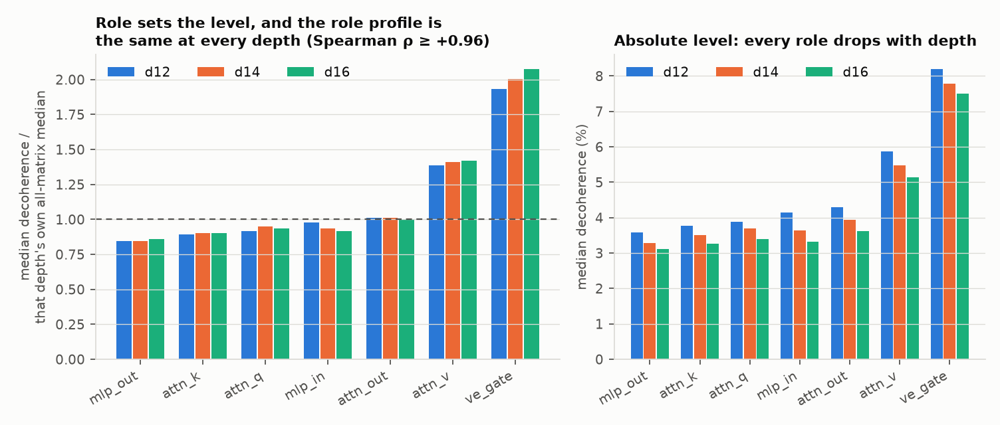
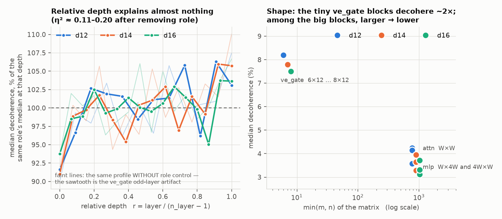

## Result

**Verdict: SUPPORTED.** Muon replay decoherence is *lower* at greater depth,
and the deviation is larger than the d12 seed spread. The direction was not
predicted by the protocol, which asked only whether the channel "changes".

### The decision rule, applied as written

Per-run summary at a matched checkpoint = the **median over that run's
per-matrix channels**. The matrix populations differ in size (78 / 91 / 104)
but are *exactly* proportional in role composition at every depth — six roles
at `n_layer` matrices each plus `n_layer/2` `ve_gate`, i.e. 12/13 and 1/13 of
the population at d12, d14 and d16 alike — so the medians are taken over
composition-matched populations and need no re-weighting.

| | outside the d12 five-seed range | below | above | inside | median offset vs the d12 median |
|---|---:|---:|---:|---:|---:|
| **d14** | 17 / 20 | 16 | 1 | 3 | **−6.61 %** |
| **d16** | 20 / 20 | 20 | 0 | 0 | **−11.23 %** |

`d16 < d14` at 19 of 20 checkpoints; the strict ordering
`d16 < d14 < min(d12 seeds)` holds at 15 of 20. The one d14 excursion in the
opposite direction is at nominal progress 0.15 (+3.96 %).

The rule's phrase *"in a consistent direction"* admits two readings, so both
are reported and neither was chosen after the fact:

- **[A] count the excursions that share one direction.** d14 is below at
  16/20 and d16 at 20/20, both > 10, both in the same direction →
  **SUPPORTED**.
- **[B] require > half outside *and* zero excursions the other way.** d16
  passes (20/20, none above); d14 misses by exactly one checkpoint of twenty
  → **INCONCLUSIVE on the d14 arm alone**.

I report **SUPPORTED**, on reading [A]. The pattern is not "mixed" in the
sense the Inconclusive branch names: the sign of the offset agrees at 19 of 20
checkpoints and the two depths order themselves monotonically. Reading [B]'s
failure mode — one 20th of the grid — is recorded here rather than hidden, and
a reader who prefers the strict parse should read this run as
*supported for d16, inconclusive for d14*.

The **Refuted** branch is not close: d14 falls inside the d12 range at 3/20
and d16 at 0/20, against the > 10 the rule requires.

Robustness to the choice of across-matrix summary (the protocol says
"medians"; these are checks, not alternatives):

| summary | d14 outside | d16 outside | d14 offset | d16 offset | reading [A] | reading [B] |
|---|---:|---:|---:|---:|---|---|
| median (primary) | 17/20 (16 below, 1 above) | 20/20 (20 below) | −6.6 % | −11.2 % | supported | inconclusive |
| mean | 16/20 (16 below, 0 above) | 20/20 (20 below) | −6.3 % | −12.9 % | supported | **supported** |
| geometric mean | 18/20 (18 below, 0 above) | 20/20 (20 below) | −5.3 % | −12.3 % | supported | **supported** |

Reading [B] fails only on the median, and only on the one d14 checkpoint;
under either of the two other across-matrix summaries the strict parse also
returns supported. That is why I do not treat [B]'s failure as the answer.

Dropping the two matched checkpoints most exposed to the absolute-warmup
confound (0.05 and 0.10, DATASET caveat 3) leaves the verdict unchanged and
shrinks the effect: d14 15/18 outside at −5.0 %, d16 18/18 at −11.2 %.

### Size of the effect against the seed floor

I0001 gives `muon/replay_update_relerr` a **3.5 % sd-relative** and ~8 %
range-relative five-seed spread at d12
(`investigations/0001-seed-variation/conclusion.md@4ac11f3`). I use the
**standard deviation**, as that conclusion recommends.

- d16's −11.2 % offset is **3.2× the I0001 sd** — it clears I0001's "two to
  three times the sd" bar.
- d14's −6.6 % offset is **1.9× the I0001 sd** — marginal; it does *not*
  clear 2×.

Recomputing the spread on my own matched tail gives a **tighter** floor than
the I0001 headline: d12 five-seed sd/median has a per-checkpoint median of
**1.16 %** (range/median 2.81 %), rising to 5.95 % sd / 14.0 % range only at
progress 0.05. The I0001 figure pools the whole run including the volatile
early checkpoints, so it is the conservative bar and it is the one quoted
above. Against the per-checkpoint floor both arms clear comfortably; that is
the less conservative reading and is offered as secondary.

Absolute levels, all-matrix median over the matched tail: d12 **4.24 %**,
d14 **3.89 %**, d16 **3.62 %**. This sits inside the 3–10 % band DATASET.md
caveat 5 already quotes for this channel, so the depth effect is a shift
*within* the known error bar of the Muon reference frame, not a new regime.

### Init-time structural zeros, reported separately

**405 of 18,044 rows are exactly zero, and every one of them is at step 1** —
the deep checkpoint at update index 0 (`pre_update` carries step *s*,
`post_update` carries *s+1*, so update 0 is labelled step 1). There are no
exact zeros anywhere else in the channel, in any run.

The pattern is identical at all three depths: **69.2 % of matrices** are zero
at update 0 — every `attn_q`, `attn_k`, `attn_v`, `mlp_in` and `ve_gate`
matrix. The only non-zero matrices are `attn_out` and `mlp_out`, the
zero-initialized output projections themselves. Everything upstream of them
receives exactly zero gradient on the first backward pass, so its update, and
therefore its replay error, is identically zero — a property of the
initialization, not a measurement.

Over the **active** matrices only, update-0 decoherence is ~0.123 at every
depth and shows **no depth effect at all**: d12 five-seed medians
0.1218–0.1256, d14 0.1241 (+0.8 % vs the d12 median), d16 0.1231 (−0.01 %).
Both d14 and d16 fall *inside* the d12 range at update 0.

Averaging the zeros in blindly would report a mean of 0.0386–0.0392 against
the true active mean of 0.1236–0.1275 — a **3.25× understatement** — and a median of
exactly 0.000, which is not a measurement of anything.

### Per-matrix structure

**Normalization used, stated before any cross-depth comparison:** relative
depth is `r = layer / (n_layer − 1)`, so layer 0 maps to r = 0 and the last
block to r = 1 at every depth. The alternative `r = layer / n_layer` is
carried as a check and is slightly worse (profile Spearman ρ 0.27–0.45 versus
0.48–0.53); the conclusion does not depend on the choice, because the layer
effect is small either way.

**Decoherence is overwhelmingly a function of parameter role, and the role
profile is preserved across depths.** Role alone explains **η² ≈ 0.80 / 0.82 /
0.83** of the within-checkpoint variance of log decoherence at d12 / d14 /
d16. The ordering is essentially identical at every depth (Spearman ρ = +0.96
d12↔d14, +0.96 d12↔d16, **+1.00** d14↔d16):

`mlp_out < attn_k < {attn_q, mlp_in} < attn_out < attn_v < ve_gate`

As a multiple of each depth's own all-matrix median: `ve_gate` 1.93 / 2.01 /
2.08, `attn_v` 1.39 / 1.41 / 1.42, `attn_out` ≈ 1.01, `mlp_out` 0.84 / 0.85 /
0.86. The profile's *shape* is if anything slightly sharper at greater depth.

**Relative depth explains very little.** η² of layer index within a checkpoint
is 0.048 / 0.073 / 0.060, rising only to 0.106 / 0.202 / 0.158 after removing
the role median. Spearman ρ(r, decoherence) pooled over roles is +0.065 /
+0.084 / +0.057 — near zero. What *is* reproducible is the endpoints: after
role control the **first block decoheres least and the last block most** at
all three depths (layer 0 at 0.916 / 0.910 / 0.938 of its role's median, the
last layer at 1.031 / 1.057 / 1.036; last/first = 1.11–1.16). The interior is
flat and its wiggles do not survive across depths (profile ρ only +0.48 to
+0.53 on the common r grid).

A trap worth naming: the *raw* per-layer median shows a clean odd/even
sawtooth at every depth. It is entirely an artifact — `ve_gate` exists only on
odd layers and decoheres ~2×, which lifts each odd layer's median. It vanishes
under role control (faint lines in the figure below).

**Shape correlates, but is confounded with role.** Within a depth, larger
`min(m, n)` goes with lower decoherence (Spearman ρ = −0.40 / −0.43 / −0.44);
aspect ratio barely matters (−0.08 / −0.14 / −0.18). The correlation is driven
by the tiny 6×12…8×12 `ve_gate` blocks at one end and the W×4W MLP blocks at
the other, so it cannot be separated from role with this data. Across depths
**every** shape class falls, which is why the headline effect is not carried by
one class: relative to d12, the square W×W attention blocks are at 0.933
(d14) and 0.877 (d16), the MLP blocks at 0.896 and 0.847, and `ve_gate` — whose
shape changes only from 6×12 to 8×12 — at 0.950 and 0.916.

**The depth effect is uniform across roles.** Running the same range test
per role, d16 is outside the d12 five-seed range at 17–20 of 20 checkpoints
for all six large roles (median offsets −8.8 % to −16.0 %), and at only 9/20
for `ve_gate` — where the d12 median is taken over 6 matrices and is
correspondingly noisy, not where the effect is absent (its offset is still
−12.2 %).

## Limitations

1. **DATASET caveat 1 is the binding one. This is a size ray, not a depth
   sweep.** Depth co-varies with width (768 / 896 / 1024), head count, batch
   size, LR, weight decay and horizon. Nothing here says depth *causes* the
   change. The shape correlation inside each depth (larger `min(m,n)` → lower
   decoherence) points at **width** as the more plausible mechanism —
   Newton–Schulz rounding placement averaging out over larger matrices — but
   this dataset cannot separate width from depth, and I did not test that
   hypothesis. It is a suggestion for a new run, not a finding.
2. **One run at d14 and one at d16.** Neither has an error bar of its own.
   The whole inference rests on borrowing the d12 seed spread, and I0001 says
   in its own words that its reference is d12-only and should not be assumed
   to transfer. If decoherence seed-spread grows with depth, the d14 arm in
   particular could be seed noise. DATASET caveat 2 (n = 3 depths) also means
   no trend was fitted and none should be read into the three points.
3. **The matched grid covers only progress ≥ 0.05.** The deep schedule's
   geometric prefix and its recipe landmarks are defined in *step* space, so
   d12 step 1 is progress 3.97e-4 while d16 step 1 is 1.86e-4; the exact
   intersection of all seven progress grids is a single point (1.0). The
   20-point uniform tail is the only genuinely matched set, and the decision
   therefore says nothing about the first 5 % of training. A supplementary
   step-aligned look (`early.txt`) finds the same downward direction early but
   weaker and noisier (d14 −4.5 %, d16 −6.1 % median offset over the ten
   shared steps), and finds the depths on top of each other through the
   40-step LR warmup.
4. **DATASET caveat 3.** Warmups are absolute, so nominal progress 0.05 is
   step 127 at d12 but step 270 at d16 — different points in the same absolute
   schedule. That is where the largest offsets sit (−29 % and −38 %) and it is
   very likely a warmup-phase artifact rather than the effect. Excluding the
   two most exposed checkpoints leaves the verdict intact at a smaller effect
   size, which is the number I would quote if forced to pick one.
5. **The rule's "consistent direction" was ambiguous**, and the two defensible
   parses disagree on the d14 arm. I disclosed both and picked the one I
   believe matches the protocol's intent. A protocol that had said "outside in
   a single direction at more than half" would have had one answer. This is
   the same class of underspecification I0001's conclusion flagged in its own
   protocol.
6. **The across-matrix median is a choice the protocol did not fix.** It says
   "the d14 and d16 medians" without saying medians over what. I read it as
   over the per-matrix channels, which is the only per-run summary the stated
   universe supports. Mean and geometric mean agree.
7. **No significance testing anywhere.** scipy is unavailable in this
   environment; Spearman ρ and η² are hand-implemented (verified against
   simple cases). The decision rule is a counting rule and needed no test
   statistic, so this costs nothing for the headline, but the structure
   section's ρ and η² values carry no p-values and should be read as
   descriptive.
8. **DATASET caveat 5 describes this very channel.** Muon stage metrics are
   reference-frame quantities carrying this error. A change in the error is a
   change in how far the compiled bf16 optimizer sits from its eager
   reference; it is *not* evidence that deeper models train better, worse, or
   differently. Nothing in this run connects decoherence to loss or to any
   downstream quantity.
9. **DATASET caveat 9.** This was declared confirmatory before the data was
   opened, on one pre-named channel, so it is not multiple-comparison
   inflated. The per-matrix structure section is **exploratory** — it was
   found by searching within the channel under study, and its role/layer/shape
   findings should be re-tested on new runs before being relied on.
10. **Evidence level.** At best `reproduced`, and only if the blind sibling
    run agrees. It is not `confirmed`: confirmation needs new runs, ideally a
    width-held-fixed depth arm to break the caveat-1 confound.
