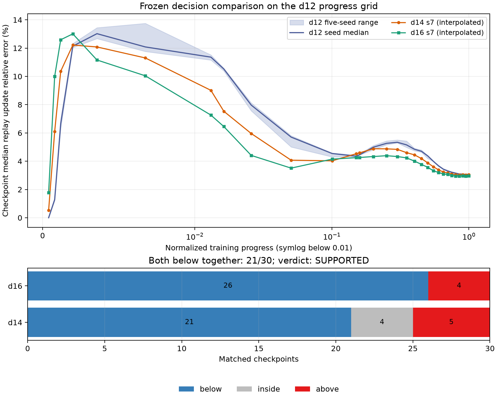
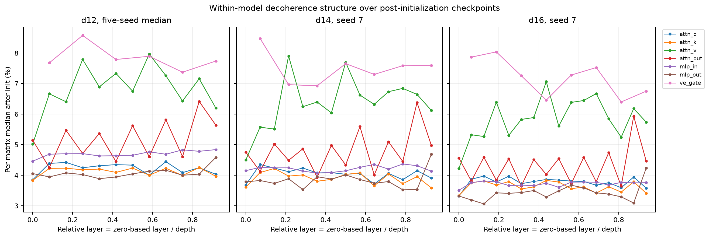

## Result

**Verdict: supported.** At each checkpoint I took the median of all defined
per-matrix `muon/replay_update_relerr` values within a run. The five d12
checkpoint medians define a pointwise min–max envelope. I linearly interpolated
the d14 and d16 checkpoint-median curves onto the 30 stored d12
`normalized_progress` values because the depth-dependent horizons make the
recorded schedules close but not identical.

| comparison with d12 five-seed range | d14 | d16 |
|---|---:|---:|
| below | 21/30 (70.0%) | 26/30 (86.7%) |
| inside | 4/30 (13.3%) | 0/30 (0%) |
| above | 5/30 (16.7%) | 4/30 (13.3%) |

The two deeper runs are **both below** the d12 range at 21/30 checkpoints
(70.0%), both above at 3/30, and both inside at 0/30. Thus they are outside on
the same, lower side at more than half of matched checkpoints, exactly meeting
the frozen support rule. Omitting the initialization checkpoint leaves the
same 21 joint-below checkpoints out of 29 (72.4%). Nearest-checkpoint matching
also gives the same individual and joint counts (maximum progress mismatch
0.0088 for d14 and 0.0090 for d16), so interpolation choice does not change the
verdict.



Across the 29 post-initialization grid points, the median matched offset from
the d12 five-seed median is **−6.44% for d14** and **−12.65% for d16**. The
actual d12 checkpoint-median spread is 1.29% sd-relative and 3.20%
range-relative (medians over checkpoints). Aggregating matrices therefore
narrows the seed spread relative to the I0001 family-level reference of **3.5%
sd-relative** and about 8% range-relative. The depth offsets are respectively
1.84 and 3.61 times the canonical 3.5% standard deviation. I0001's practical
roughly-10% detection heuristic is cleared by d16 but not by the d14 median
offset; the frozen rule nevertheless supports the claim because it uses the
observed five-seed envelope and checkpoint consistency, not that heuristic.

This is support for a change along the nanochat size ray, not evidence that
depth itself causes the change. It is also not “confirmed” evidence under the
working procedure, which reserves that label for a frozen claim tested on new
runs.

### Initialization zeros

The sparse post-update label `step == 1` is deep update index 0. At that
checkpoint, exactly 54/78 d12 matrices in every seed, 63/91 d14 matrices, and
72/104 d16 matrices are zero: **69.23% at every depth**. All `attn_q`,
`attn_k`, `attn_v`, `mlp_in`, and `ve_gate` matrices are zero; all `attn_out`
and `mlp_out` matrices are nonzero. Consequently the raw all-matrix median is
zero at each run's actual initialization checkpoint. I report that population
separately and exclude it from every across-time and structural summary above
and below. All 17,459 selected post-initialization matrix rows are positive.

The primary normalized-progress interpolation maps the first d12 progress
value between later-depth observations, so its first comparison is not itself
an initialization average. Treating update index 0 as a matched structural
landmark instead changes that one comparison to “inside” for both depths but
leaves the 21/30 joint-below support count unchanged.

### Per-matrix structure

For cross-depth layer structure I used the protocol's literal normalization,
**zero-based layer index divided by model depth** (`layer / depth`). I first
took each matrix's median over post-initialization checkpoints; for d12 I then
took the median of that quantity over its five seeds.

| parameter role | d12 | d14 | d16 |
|---|---:|---:|---:|
| `attn_q` | 4.234% | 4.017% | 3.745% |
| `attn_k` | 4.144% | 3.868% | 3.606% |
| `attn_v` | 6.705% | 6.260% | 5.679% |
| `attn_out` | 5.070% | 4.676% | 4.114% |
| `mlp_in` | 4.680% | 4.221% | 3.738% |
| `mlp_out` | 4.091% | 3.769% | 3.386% |
| `ve_gate` | 7.826% | 7.381% | 7.229% |

Role is the preserved organizing variable. After log-transforming the
per-matrix summaries and removing each depth's overall mean, role accounts for
87.8% of descriptive variance. Relative-layer quartile alone accounts for
0.4%; role plus relative-layer quartile accounts for 89.9%. Across the 28
role-by-relative-quartile cells, the raw log-profile correlation with d12 is
0.967 for both d14 and d16. Once each role is centered, it falls to 0.111 and
0.401. Thus the broad distribution is strongly preserved across depths because
the role hierarchy is preserved (`ve_gate` and `attn_v` high; `attn_k`,
`attn_q`, and `mlp_out` low), while a fine relative-layer pattern is weak and
not comparably stable.



Matrix shape could not be tested honestly: the schema has a `shape` column,
but it is null in every one of the 18,044 selected rows (and the role/width
combinations would confound shape with role and scale even if shapes were
reconstructed). I therefore made no inferred-shape classification. This is a
deviation from the protocol's requested three-way structural report and is
carried as a limitation rather than filled with architectural assumptions.

## Limitations

- This is the nanochat **size ray**, not an isolated depth sweep. Width, head
  count, batch size, learning rate, weight decay, and horizon co-vary with
  depth. The supported statement is therefore “decoherence changes along this
  recipe at scale,” not “depth causes lower decoherence” (data-card caveat 1).
- There are only three depths and one run each at d14 and d16. I0001's 3.5%
  standard-deviation reference is d12-only and need not transfer to the deeper
  configurations (caveat 2 and the I0001 gate warning).
- The 40-step LR warmup and 400-step Muon momentum ramp occupy different
  normalized fractions at each depth. The deeper curves are above the d12
  envelope at the earliest points and below later, so this absolute-warmup
  confound is visibly relevant (caveat 3).
- The stored checkpoint grids are not identical. Linear interpolation onto
  d12 progress is an analyst choice not specified further by the frozen
  protocol. The nearest-checkpoint and initialization-landmark sensitivities
  give the same verdict, but both alignment schemes have finite progress
  mismatch.
- Exact matrix shapes are unavailable because `shape` is null throughout the
  selected family. Shape effects are not resolved, and role, shape, and model
  scale are not independently varied.
- Compiled GPU training is not bit-reproducible. Seed spread includes both
  trajectory variation and the documented atomic-accumulation nondeterminism
  (caveat 7).
- The relative-layer, role-variance, and correlation summaries are secondary
  descriptive analyses requested by the protocol; they have no predeclared
  inferential threshold. The only confirmatory verdict is the one-family
  frozen decision above. No other metric family was searched, limiting the
  multiple-comparison concern but not eliminating over-interpretation of the
  structural diagnostics (caveat 9).
- Curvature certification, probe sampling, and noise-scale instrumentation
  caveats (4, 6, and 8) do not enter this metric. Data-card caveat 5 is the
  phenomenon measured here: the values quantify compiled bf16 Muon updates'
  3–10% per-matrix disagreement with the eager reference rather than an error
  in the analysis pipeline.

Reproduce with:

```bash
.venv/bin/python investigations/0003-decoherence-vs-depth/A0002/analyze.py
```
