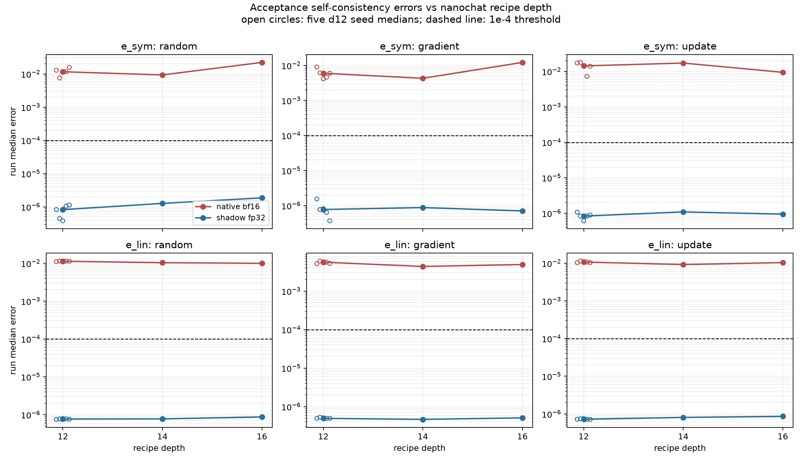
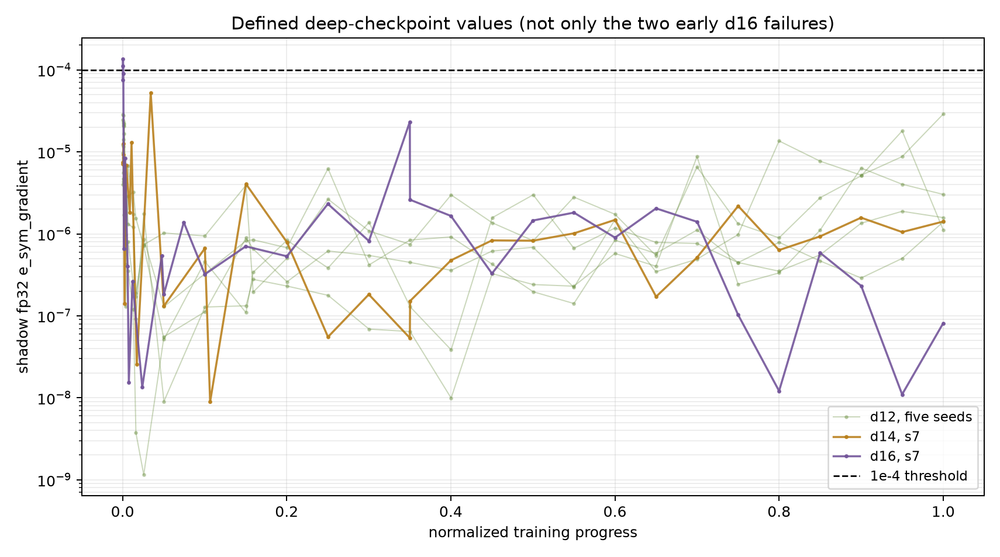

## Result

**Overall outcome: inconclusive.** The claim is not consistent across the six
prespecified shadow-fp32 channels: three are **supported** and three are
**refuted** by the frozen per-channel rule. Most importantly for the proposed
d18/d20 runs, `e_sym_gradient` is **refuted**, not supported. Its d16 median
is inside the d12 five-seed range and the depth medians are non-monotone.
The protocol supplied no rule for collapsing six mixed channel outcomes, so I
did not introduce a post hoc aggregate decision.

The unit of analysis is one run. I took each run's median across every defined
deep checkpoint, then used the median and full min--max band of the five d12
run medians. Thus the d12 seed band is not a checkpoint range. There were
2,580 selected rows: 30 deep checkpoints per d12 run, 32 at d14, and 33 at
d16; none of the target rows was undefined.

### Frozen decisions in the shadow-fp32 arm

| channel | d12 median [five-seed min, max] | d14 | d16 | ordering / d12 comparison | decision |
|---|---:|---:|---:|---|---|
| `e_sym_random` | 8.274e-7 [3.814e-7, 1.137e-6] | 1.274e-6 | 1.870e-6 | monotone; d16 > d12 max | **supported** |
| `e_sym_gradient` | 7.747e-7 [3.685e-7, 1.549e-6] | 8.814e-7 | 7.038e-7 | non-monotone; d16 inside d12 range | **refuted** |
| `e_sym_update` | 8.321e-7 [6.126e-7, 1.073e-6] | 1.092e-6 | 9.454e-7 | non-monotone; d16 inside d12 range | **refuted** |
| `e_lin_random` | 7.666e-7 [7.492e-7, 7.743e-7] | 7.751e-7 | 8.717e-7 | monotone; d16 > d12 max | **supported** |
| `e_lin_gradient` | 4.961e-7 [4.945e-7, 5.315e-7] | 4.650e-7 | 5.115e-7 | non-monotone; d16 inside d12 range | **refuted** |
| `e_lin_update` | 7.248e-7 [7.148e-7, 7.521e-7] | 8.082e-7 | 8.628e-7 | monotone; d16 > d12 max | **supported** |

The three supported trends meet the frozen rule relative to the observed d12
run-median range, but are operationally far from the threshold. The largest
d16 shadow median is `e_sym_random` at 1.870e-6, about 53 times below 1e-4.

### Native arm, reported but not used for the decision

| channel | d12 median [five-seed min, max] | d14 | d16 |
|---|---:|---:|---:|
| `e_sym_random` | 1.165e-2 [7.542e-3, 1.584e-2] | 9.337e-3 | 2.219e-2 |
| `e_sym_gradient` | 5.981e-3 [4.165e-3, 9.007e-3] | 4.290e-3 | 1.218e-2 |
| `e_sym_update` | 1.431e-2 [7.265e-3, 1.794e-2] | 1.723e-2 | 9.447e-3 |
| `e_lin_random` | 1.131e-2 [1.111e-2, 1.144e-2] | 1.036e-2 | 9.962e-3 |
| `e_lin_gradient` | 5.653e-3 [5.193e-3, 6.044e-3] | 4.368e-3 | 4.904e-3 |
| `e_lin_update` | 1.075e-2 [1.038e-2, 1.142e-2] | 9.236e-3 | 1.040e-2 |

All native medians are far above 1e-4. This agrees with the data card's
warning that native bf16 curvature is uncertified everywhere; these values
are acceptance diagnostics, not certified curvature measurements.

### `e_sym_gradient` threshold crossing and d18/d20

The shadow `e_sym_gradient` medians are 7.747e-7, 8.814e-7, and 7.038e-7 at
d12, d14, and d16. The d16 median is about **142 times below** 1e-4. The two
shakedown values that motivated the hypothesis are present: 1.111e-4 and
1.359e-4 at d16 post-update steps 2 and 3. They are two of 33 defined deep
checkpoints, and the completed run does not sustain those errors. No d12 or
d14 `e_sym_gradient` checkpoint exceeds 1e-4.

There is **no supportable finite crossing-depth estimate**. With only three
depths, one seed at d14/d16, a non-monotone sequence, and d16 below d14, both
raw-linear and log-linear fits have negative slope whether fitted to all
three depths or only d14--d16. Reporting a d18/d20 crossing from these points
would therefore manufacture an answer rather than estimate one.

**Recommendation:** do not raise the 1e-4 threshold or abandon d18/d20 on the
basis of a supposed median depth trend. These data do not support that trend
for the gradient direction and do not show the median approaching the
threshold. D18/d20 remain plausible for *certified gradient-direction*
curvature, although isolated very-early failures may recur and should be
monitored; the runs themselves must establish certification. Do not expect all
three directions to certify: the I0001 seed reference
(`investigations/0001-seed-variation/conclusion.md@4ac11f3`) reports that only
the gradient direction ever passed at d12, with random/update failures driven
by other acceptance conditions. Passing `e_sym`/`e_lin` alone is not
sufficient for a per-direction verdict.

Exact derived tables are in `run_medians.csv`, `depth_summary.csv`, and
`decision.csv`; `crossing_sensitivity.csv` records the four deliberately
non-inferential fit checks.

## Limitations

- **No deviation from the frozen data selection or decision rule.** The
  protocol did not spell out the two-level aggregation needed for five d12
  seeds, so I operationalized "median" as a median over deep checkpoints
  within each run and then the median across the five d12 run medians. This
  preserves seeds as the comparison units used by "maximum across the five
  d12 seeds." Different checkpoint weighting was not tested because it was
  not prespecified.
- This is the nanochat recipe size ray, not depth in isolation. Width, head
  count, batch size, learning rate, weight decay, and horizon co-vary with
  depth.
- There are only three sizes and only one seed at d14 and d16. The I0001 d12
  seed range is used exactly as required, but it must not be assumed to be the
  seed distribution at larger sizes. No uncertainty interval for a crossing
  depth is identifiable from this design.
- Deep schedules contain 30, 32, and 33 checkpoints. They have the same
  normalized-progress shape but not identical grids. Absolute 40-step and
  400-step warmups also occupy different fractions of training; this matters
  especially because the two d16 threshold breaches occur at steps 2 and 3.
- Medians answer the frozen rule but do not guarantee every checkpoint
  passes. Conversely, an isolated breach does not establish that typical
  self-consistency degrades with scale.
- The six error channels are only part of the acceptance suite. Noise-floor
  and other verdict criteria can prevent certification even when both errors
  are below 1e-4; this analysis cannot promise certification before d18/d20
  are measured.
