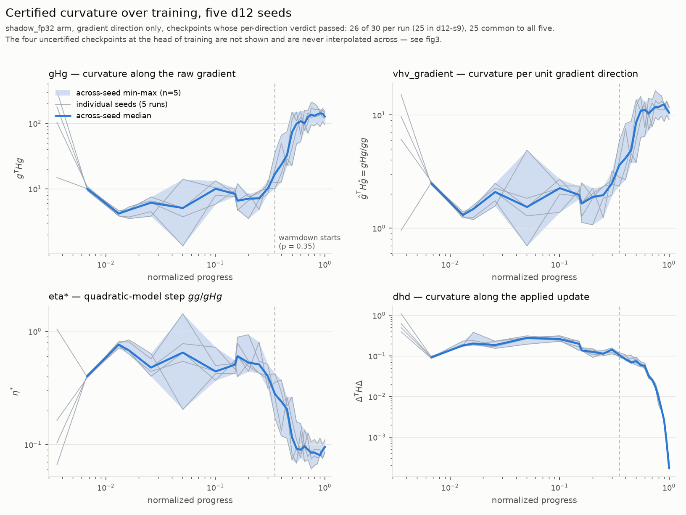
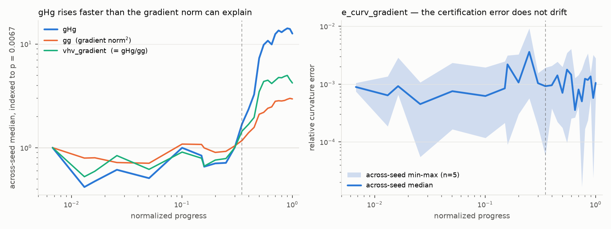
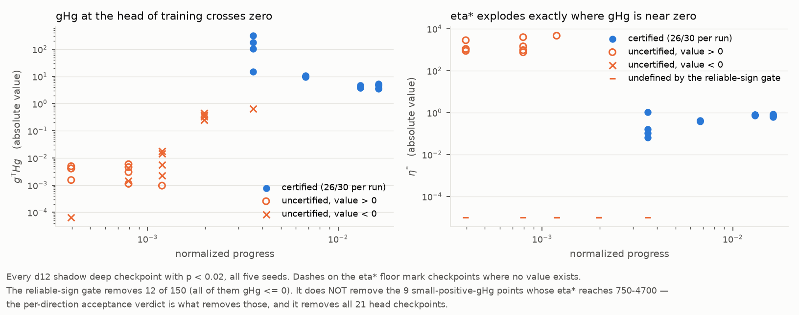

## Result

The protocol asks a descriptive question, not a hypothesis with a decision rule.
`outcome: supported` here means the trajectory is resolved on the five declared
channels; nothing was refuted because nothing was on trial.

Every statement below is tagged **SHAPE** (within one run, over
`normalized_progress` — seed noise does not limit this) or **LEVEL** (a value
compared between runs — limited by I0001).

### 1. What is available, and what is not

| population | passed | inconclusive | failed |
|---|---:|---:|---:|
| shadow, per-direction, **gradient** | **129** | 21 | 0 |
| shadow, per-direction, random | 0 | 148 | 2 |
| shadow, per-direction, update | 0 | 149 | 1 |
| shadow, checkpoint-level verdict | 0 | 147 | 3 |
| native, every direction | 0 | 0 | 450 |

(150 d12 shadow deep checkpoints = 5 runs x 30.)

**The random and update directions are unavailable, not omitted.** They pass at
zero checkpoints in all five d12 runs, exactly as
`0001-seed-variation/conclusion.md@4ac11f3` reported. Nothing in this result
describes curvature along them, and the native arm — failed at 450 of 450
direction-checks — is out of scope by the protocol and by DATASET caveat 4.
There is also **no checkpoint-level certification at all**: certified curvature
in this dataset exists only as a per-direction record along the gradient.

Per run the gradient direction certifies **26 of 30** checkpoints (25 in
`d12-s9`), and **25 checkpoints are common to all five runs**, spanning
`normalized_progress` 0.0067 to 1.0. The uncertified 21 are all at the head of
training — update indices 0, 1, 2, 4 in every run, plus index 8 in `d12-s9`
(p <= 0.0036). Nothing is interpolated across them.

### 2. The eta* reliable-sign gate, and the trap it does not catch

The instrument's gate (`reliable-sign-v2`) defines eta* only when gHg > 0 and
rho = gHg/(||g|| ||Hg||) > 8 * arith_eps = 9.54e-7.

- It excludes **12 of the 150** d12 shadow deep checkpoints.
- It excludes **0 of the 129 certified** checkpoints. All twelve exclusions
  carry `undefined_reason == "gHg_not_positive"`; **none** carries
  `sign_below_noise`. At d14 it excludes 1 of 32 and at d16 1 of 33, again none
  of them certified.
- At the 129 certified checkpoints the margin is enormous: rho spans
  0.126–0.679, i.e. 1.3e5 to 7.1e5 times the threshold; min gHg = 1.344,
  min gg = 1.93. No certified eta* is a near-zero-over-zero ratio.

**The gate alone would not have protected this analysis.** At 9 of the 21
uncertified head checkpoints gHg is small and *positive* (9.6e-4 to 5.9e-3), so
the sign gate passes and eta* is *defined* — at values of 754 to 4657, four
orders of magnitude above anything in the certified set (0.061 to 1.44). What
removes those points is the **per-direction acceptance verdict**, not the sign
gate. Figure 3 shows this directly. Reading a trajectory off the head of
training therefore produces a spurious four-decade collapse in eta* that is
entirely an artefact of gHg crossing zero.

### 3. The trajectories (SHAPE)

The recipe's warmdown begins at step 882/2520 at d12 — `normalized_progress`
**0.350**, and 0.350 at d14 and d16 as well. Split there:

| channel | pre-warmdown Spearman(p, y), 5 seeds | warmdown Spearman | seeds agreeing | median(warmdown)/median(pre) | across-seed sd of that ratio |
|---|---|---|---:|---|---:|
| `curvature/gHg` | −0.26 … +0.28 | **+0.62 … +0.95** | 5/5 rising | **15.6x** (12.4 – 21.3) | 23% |
| `curvature/vhv_gradient` | −0.43 … +0.42 | **+0.39 … +0.82** | 5/5 rising | **4.76x** (4.45 – 7.12) | 23% |
| `curvature/eta_star` | −0.42 … +0.43 | **−0.82 … −0.39** | 5/5 falling | **0.21x** (0.14 – 0.22) | 17% |
| `curvature/dhd` | −0.48 … −0.22 | **−0.996 … −0.97** | 5/5 falling | **0.164x** (0.136 – 0.181) | 12% |
| `curvature/e_curv_gradient` | −0.05 … +0.54 | −0.20 … +0.31 | 3/5 (no agreement) | 1.43x (0.60 – 2.01) | 44% |
| `curvature/gg` (support) | +0.02 … +0.52 | +0.82 … +0.99 | 5/5 rising | 2.73x (2.35 – 3.10) | 10% |
| `update/direction_norm` (support) | +0.26 … +0.45 | −1.00 … −1.00 | 5/5 falling | 0.570x (0.562 – 0.572) | 0.7% |

**gHg is flat while the learning rate is flat, and rises about 15-fold during
warmdown.** Through the constant-LR body (p < 0.35, 11–12 certified points) no
seed shows a consistent direction: three of five have a positive rank
correlation with progress, two negative, all weak. From the warmdown boundary
onward all five rise over the remaining 14 certified points, with rank
correlations +0.62 to +0.95. Seed-to-seed rank
concordance of the whole gHg trajectory is high — median pairwise Spearman
**0.90** (0.85–0.93) — so the five runs trace the same curve, not five
different ones.

**The rise stops.** Over the last eight certified points (p >= 0.65) there is
no agreed direction (3 of 5 positive, Spearman −0.60 to +0.83): gHg plateaus at
an across-seed median of **131**, having sat at a median of **6.9** before
warmdown.

**Most, but not all, of the rise is real sharpening rather than a bigger
gradient.** `vhv_gradient` is the Rayleigh quotient along the *unit* gradient —
I verified the identity `vhv_gradient == gHg/gg` holds to 2.9e-7 relative — and
it rises 4.76x, while `gg` (the squared probe-gradient norm) rises 2.73x.
Taking each run's own log-share of its own gHg ratio: **61%** of the rise is
curvature per unit direction and **37%** is gradient growth (medians over the
five seeds; the shares do not sum to exactly 1 because a median of ratios is
not multiplicative). Fig 2, left.

**eta\* is the exact reciprocal of vhv_gradient** (the identity
`eta_star == gg/gHg` holds to 1.2e-15), so it carries no independent
information: it falls 4.8x, from an across-seed median of 0.53 before warmdown
to **0.087** in the tail; its full certified range is 0.061 to 1.44.
Reporting both is reporting one channel twice.

**dhd falls, but almost entirely because the update shrinks.** dhd is curvature
along the *actual applied update*, not along the gradient, and it is the most
monotone channel in the set (whole-trajectory Spearman −0.93 to −0.92; pairwise
seed concordance median 0.97). It drops 1600–4500x from its early peak to the
final checkpoint. But `update/direction_norm` drops 33x over the same span, and
`dhd / ||delta||^2` — which equals `curvature/vhv_update` to 2.4e-7 — falls only
about 2x from its pre-warmdown median to its warmdown median (0.48–0.62 per
run), and about 5x from the first checkpoint common to all five runs to the
last. So the dhd trajectory is dominated by the warmdown shrinking the step,
and says little about the curvature the optimizer actually moves through.
That decomposition is descriptive only: `vhv_update` is **uncertified**.

**The instrument does not drift.** `e_curv_gradient` is the acceptance suite's
own relative curvature error, not a property of the loss surface. It has no
trend (Spearman −0.13 to +0.30, three of five positive; pairwise seed
concordance median −0.05), sits at an across-seed median near 1e-3 throughout,
and its warmdown/pre ratio is 1.43x with a 44% across-seed spread on the ratio —
noise. The gHg rise is therefore not an artefact of certification quality
degrading as training proceeds (fig 2, right).

### 4. What can be compared between runs (LEVEL), and what cannot

Across-seed spread at matched certified checkpoints, standard deviation relative
to the across-seed median, median over the 25 common checkpoints:

| channel | this run, certified set | I0001 sd-relative | verdict |
|---|---:|---:|---|
| `curvature/gHg` | 27.6% (max 98%) | 29% | consistent |
| `curvature/eta_star` | 23.9% (max 70%) | 25% | consistent |
| `curvature/dhd` | 13.2% (max 41%) | 13% | consistent |
| `curvature/vhv_gradient` | 22.0% | — | — |
| `curvature/gg` | 8.4% | — | — |

This is a consistency check, not a re-derivation: the I0001 sd-relative column
was computed on the unrestricted channel, and mine on the verdict-restricted
shadow/gradient population. That they land within two points of each other is
reassuring about both pipelines.

Applying I0001's practical rule (an effect must clear roughly 2–3x the channel's
sd-relative spread):

- **The 15.6x warmdown rise in gHg is a SHAPE claim and clears everything.** It
  is a within-run change, so the seed reference does not bound it directly; what
  the reference does establish is that the *ratio itself* has only a 23%
  across-seed spread and the same sign in five of five runs, so the shape is not
  a seed accident.
- **Between-seed differences in the plateau level are NOT resolvable.** Over the
  last eight certified points the five runs give gHg tail medians of 95.0, 128,
  131, 151, 158 — sd-relative **19%**, max/min 1.67x — comfortably inside the
  29% one-sd reference. The same holds for eta* (14.9% vs 25%), vhv_gradient
  (14.3%) and dhd (16.9% vs 13%, well under the 2–3x rule). No run can be called
  sharper than another at the end of training.

### 5. d14 and d16 — described, never pooled

One run each, and I0001 is d12-only, so there is no error bar at these depths
and **no comparative claim is made**.

| run | certified | gHg pre-warmdown | gHg warmdown | ratio | warmdown Spearman | eta* ratio | dhd ratio |
|---|---:|---:|---:|---:|---:|---:|---:|
| d14-s7 | 28/32 | 7.6 | 375 | 49.6x | +0.72 | 0.094x | 0.174x |
| d16-s7 | 29/33 | 8.9 | 304 | 34.3x | +0.74 | 0.126x | 0.096x |
| (d12, 5 seeds) | 25–26/30 | 6.4 – 9.3 | 79 – 148 | 12.4 – 21.3x | +0.62 … +0.95 | 0.14 – 0.22x | 0.136 – 0.181x |

The qualitative shape is identical at all three depths — flat through the
constant-LR body, a large rise locked to the warmdown boundary at p = 0.35,
a plateau. The larger ratios at d14 and d16 sit outside the d12 five-seed range,
but DATASET caveats 1–3 (this is a size ray, n = 3 depths, absolute rather than
proportional warmups) and the absence of any seed reference above d12 mean that
observation is a hypothesis for a future investigation, not a finding.

### 6. Plain statement about sharpening

Along the gradient direction, on the fp32 shadow surface, at the 25 checkpoints
per run that certify:

- Curvature **does not systematically sharpen during the constant-learning-rate
  phase.** Whatever the popular picture, at p < 0.35 these five runs show no
  agreed direction in gHg or in vhv_gradient.
- Curvature **sharpens sharply and reproducibly during warmdown**: gHg x15.6,
  direction-normalized curvature x4.8, eta* /4.8, in five of five seeds, then
  plateaus over the final third.
- This is a statement about **one direction on one probe batch on a surface the
  optimizer does not run on**. It is not a statement about the spectrum, the top
  eigenvalue, or the edge of stability. The random and update directions —
  which is where "is the model at the edge of stability" would actually be
  tested — never certify, so that question is not answerable from this dataset.
- Four of 30 checkpoints per run are missing (five in `d12-s9`), and they are
  exactly the ones that matter most for the earliest dynamics (p <= 0.0036).
  Nothing here describes the first 0.4% of training.

## Limitations

**Deviations from the protocol.**

1. The protocol's allowed-input list does not name the instrument source. I read
   `nanochat/telemetry.py@273c8bd` for the *definitions* of `eta_star`,
   `update_effectiveness`, `hvp_acceptance` and `_emit_acceptance` — no results,
   no other analyst's work — because the reliable-sign gate's rule and the exact
   meaning of `dhd`, `vhv_*` and `e_curv_*` are not in DATASET.md and the
   protocol asks specifically about the gate. Disclosed here and in `saw:`.
2. The protocol's universe says "any other certified **scalar**". I therefore
   excluded the 36 vector `sweep:eps-ascending-v1` channels rather than choosing
   an unauthorized summary statistic for them. They are not analysed here.
3. I did not read `profiles/`, which the protocol allowed. Everything was
   recomputed from the segments.
4. `curvature/dhd` is selected by the **gradient**-direction verdict but is
   itself a curvature along the **update** direction, whose own verdict never
   passes. The protocol's selection clause requires this. It should be read as
   "the HVP operator was accepted at this checkpoint along the gradient", which
   is weaker than "this dhd value is certified". I flag it rather than drop it.

**What could make this wrong.**

- **Probe sampling (DATASET caveat 6).** Every quantity here is measured on the
  frozen `probe_short` batch, drawn per seed. Within a run the comparison is
  same-probe and internally consistent, which is precisely why the SHAPE claims
  are the strong ones and the LEVEL claims are not. A different probe batch
  could shift the levels; it is unlikely to invent a 15x rise locked to a
  schedule landmark in five independent runs.
- **The shadow arm is not the training surface.** `shadow_fp32` is a disposable
  IEEE-fp32 upcast at theta_s, measured with TF32 off and math-SDPA. The bf16
  surface the optimizer actually experiences fails acceptance everywhere
  (caveat 4), so certified curvature is necessarily a statement about a surface
  the optimizer does not run on. Whether the two surfaces agree is a different
  investigation.
- **The warmdown co-timing is a coincidence of schedule, not a demonstrated
  cause.** The rise starts at the warmdown boundary in all five d12 runs and in
  d14 and d16, but nothing here varies the schedule, so "warmdown causes
  sharpening" is not established — only that the two co-occur, at the same
  normalized progress, at three depths.
- **Multiple comparisons (caveat 9).** Five channels were declared in advance;
  I scored 57. The 52 undeclared ones are exploratory and are reported only in
  `out/universe.csv`.
- **Redundancy in the declared universe.** `eta_star`, `vhv_gradient` and
  `gHg`/`gg` are three views of two numbers (identities verified to 1.2e-15 and
  2.9e-7). A reader should not count agreement among them as independent
  evidence.
- **Resolution.** 25–26 points per run on a log-spaced schedule; the warmdown
  region carries 14 of them. The plateau claim rests on 8 points per run.
- **n = 5, d12 only.** I0001's warning applies in full: curvature is a weak
  response variable at n = 5, and nothing at d14 or d16 has an error bar.
- **Excluded from the data by construction**: `d12-iter` (schema v1, no shadow
  arm), the native arm, the random and update directions, and the 21 uncertified
  head checkpoints.

**Reproducing.** `python extract.py && python analyze.py && python phases.py &&
python gate.py && python universe.py && python figures.py` with
`analysis/.venv/bin/python`. Intermediate tables land in `out/`, figures in
`figures/`. No scipy is used; `stats.py` implements tie-averaged ranks and
Spearman directly.
