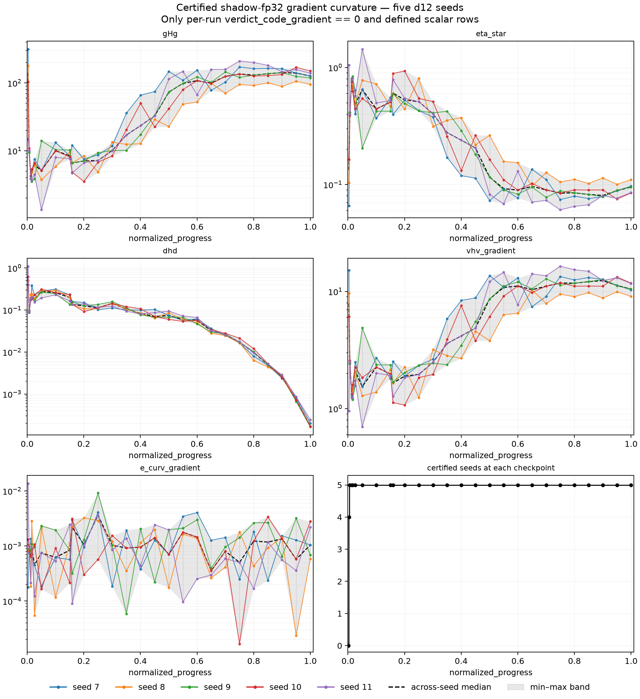
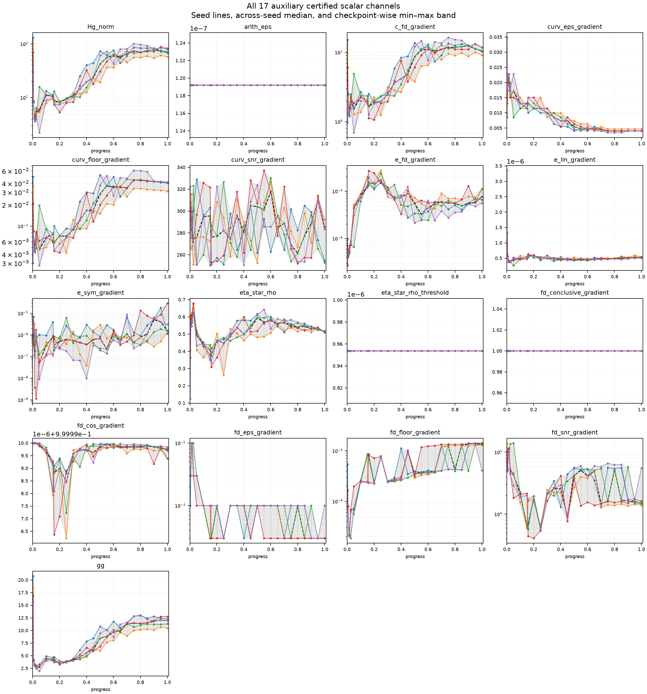

## Result

Certified curvature has a clear but narrow trajectory: **the shadow-fp32
surface sharpens late along the gradient direction, then largely plateaus or
relaxes slightly**. This is supported as a within-run shape, not as a claim
about native bf16 curvature, random/update directions, other model sizes, or
all directions of the Hessian.

### Availability and gates

- **[SELECTION]** The shadow-fp32 gradient verdict passed at **129/150
  run-checkpoints**: 26/30 for seeds 7, 8, 10, and 11, and 25/30 for seed 9.
  There are **25/30 checkpoints common to all five runs**. Four early
  checkpoints have no passing seed, the next has four, and the remaining 25
  have all five.

- **[SELECTION]** Random-direction verdicts passed **0/150** (148
  inconclusive, 2 failed), and update-direction verdicts passed **0/150**
  (149 inconclusive, 1 failed). Their certified trajectories are therefore
  **unavailable**, not omitted.

- **[SELECTION]** The eta* reliable-sign gate excluded **12/150 raw
  shadow-fp32 checkpoints**: 2, 2, 3, 4, and 1 for seeds 7–11. All 12 have
  `undefined_reason == gHg_not_positive`. All were already outside the
  passing gradient population, so the gate excluded **0 additional points
  among the 129 certified checkpoints**. No eta* curve is drawn through an
  undefined checkpoint.

### Primary trajectories

The first checkpoint certified in all five runs is normalized progress
0.006746; it is the common starting point for the within-run ratios below.
The bands are min–max across seeds and are descriptive comparisons, not
confidence intervals.

| metric | **[SHAPE]** end/start within each run | **[COMPARISON]** band at 0.006746 | **[COMPARISON]** band at 1.0 | I0001 sd-relative reference |
|---|---:|---:|---:|---:|
| `curvature/gHg` | 9.31–13.87× | 9.398–10.90 | 95.07–150.5 | 29% |
| `curvature/eta_star` | 0.216–0.274× (3.64–4.62× lower) | 0.3877–0.4139 | 0.08475–0.1101 | 25% |
| `curvature/dhd` | 0.00165–0.00260× (385–606× lower) | 0.08701–0.09952 | 0.0001643–0.0002440 | 13% |
| `curvature/vhv_gradient` | 3.65–4.62× | 2.416–2.579 | 9.079–11.80 | not provided by I0001 |
| `curvature/e_curv_gradient` | 0.558–3.49×; 3/5 end higher | 0.000745–0.001048 | 0.000585–0.002792 | not provided by I0001 |

- **[SHAPE]** `vhv_gradient`, the normalized directional-curvature
  quantity, stays low and uneven through about progress 0.30, then rises in
  **every run by 2.98–6.61× from 0.30 to 0.75**. From 0.75 to the endpoint it
  is 0.711–0.997× its 0.75 value in every run: a high late plateau with some
  relaxation, not indefinite monotone sharpening.

- **[SHAPE]** `gHg` tells the same late-sharpening story at larger amplitude:
  it rises **7.09–21.19× in every run from progress 0.30 to 0.75**, then ends
  at 0.662–1.110× its 0.75 value. The auxiliary `gg` channel rises only
  2.56–3.03× from the first common checkpoint to the end, while
  `vhv_gradient` rises 3.65–4.62×, so the gHg rise is not merely a changing
  gradient norm.

- **[SHAPE]** Eta* is non-monotone early but falls in every run to
  0.151–0.336× its progress-0.30 value by 0.75, followed by a modest
  1.003–1.407× rebound by the endpoint. Across the full common support it
  ends at 0.216–0.274× its starting value. This description uses only
  reliable-sign, certified values and does not bridge the 12 undefined raw
  points.

- **[SHAPE]** `dhd` generally falls after its early values and collapses most
  strongly late. From progress 0.75 to 1.0 alone it falls another 72–126× in
  every run. This is a trajectory description; no causal interpretation is
  assigned to the training schedule or update magnitude.

- **[SHAPE]** `e_curv_gradient` is jagged rather than directional: only 3/5
  runs end higher than the first common point, and its endpoint ratios span
  0.558–3.49×. On the 25 all-five checkpoints it ranges from 1.66e-5 to
  9.18e-3. It supplies no sharpening claim; it remains a small acceptance
  residual at every certified point.

**[COMPARISON]** The figure's gray region and vertical bars are the min–max
seed band at each available checkpoint, the dashed line is the median, and
the colored lines are the individual seeds. The bottom-right panel gives the
number of certified seeds at every scheduled checkpoint. The four-seed point
at progress 0.003571 is shown but is not used in any all-five headline
comparison.

### Seed-reference comparison

- **[COMPARISON]** At the first common point, the across-seed medians are
  gHg 10.04, eta* 0.4014, and dhd 0.09208. At the endpoint they are gHg
  126.5, eta* 0.09539, and dhd 0.0001704. These median changes are about
  12.6×, 4.21× downward, and 540× downward, respectively. They are vastly
  larger than the I0001 one-standard-deviation references of 29%, 25%, and
  13%, and clear I0001's practical 2–3×-SD detection rule.

- **[COMPARISON]** The endpoint min–max bands are gHg 95.07–150.5, eta*
  0.08475–0.1101, and dhd 0.0001643–0.0002440. Their endpoint sample-SD
  relative to the median is 16.7%, 10.8%, and 19.9%, respectively. Exact
  between-seed ordering or small checkpoint differences should not be read
  from these bands; the I0001 limits still apply to value comparisons.

- **[SHAPE]** The claims that each run rises or falls by the factors reported
  above are same-run trajectory claims and are not limited by the I0001
  between-run seed spread. Seeing the same qualitative phase structure in all
  five runs makes the descriptive shape robust within this dataset, but does
  not turn it into new-run confirmation.

### Checkpoint-wise bands for all five primary quantities

**[COMPARISON]** Each populated cell is `median [minimum, maximum]` across
only the seeds whose gradient-direction verdict passed at that checkpoint.
The `n` column prevents a four-seed band from being mistaken for a five-seed
band. Dashes mean certified curvature was unavailable, not zero.

All 30 scheduled checkpoints

| normalized progress | certified n | gHg | eta* | dhd | vhv_gradient | e_curv_gradient |
|---:|---:|---:|---:|---:|---:|---:|
| 0.000397 | 0 | — | — | — | — | — |
| 0.000794 | 0 | — | — | — | — | — |
| 0.001190 | 0 | — | — | — | — | — |
| 0.001984 | 0 | — | — | — | — | — |
| 0.003571 | 4 | 141.2 [14.90, 315.4] | 0.1334 [0.06592, 1.048] | 0.5609 [0.3954, 1.102] | 7.902 [0.9544, 15.17] | 0.001082 [1.787e-4, 0.01375] |
| 0.006746 | 5 | 10.04 [9.398, 10.90] | 0.4014 [0.3877, 0.4139] | 0.09208 [0.08701, 0.09952] | 2.491 [2.416, 2.579] | 8.898e-4 [7.452e-4, 0.001048] |
| 0.013095 | 5 | 4.193 [3.847, 4.654] | 0.7647 [0.7116, 0.8110] | 0.1812 [0.1720, 0.2324] | 1.308 [1.233, 1.405] | 6.386e-4 [1.859e-4, 0.001356] |
| 0.016270 | 5 | 4.761 [3.512, 5.319] | 0.6779 [0.6273, 0.8411] | 0.2023 [0.1843, 0.3836] | 1.475 [1.189, 1.594] | 9.207e-4 [6.547e-4, 0.002866] |
| 0.025794 | 5 | 6.148 [3.826, 7.510] | 0.4788 [0.4012, 0.6373] | 0.1851 [0.1531, 0.2305] | 2.089 [1.569, 2.493] | 4.504e-4 [5.507e-5, 0.001071] |
| 0.050397 | 5 | 5.101 [1.344, 14.02] | 0.6497 [0.2039, 1.436] | 0.2785 [0.1941, 0.3131] | 1.539 [0.6966, 4.905] | 7.530e-4 [1.654e-4, 0.002330] |
| 0.100397 | 5 | 10.02 [5.854, 13.24] | 0.4428 [0.3688, 0.7231] | 0.2592 [0.2289, 0.3138] | 2.258 [1.383, 2.712] | 6.214e-4 [1.173e-4, 0.001942] |
| 0.150397 | 5 | 8.426 [7.632, 10.25] | 0.5071 [0.4236, 0.5545] | 0.1991 [0.1360, 0.2323] | 1.972 [1.804, 2.361] | 8.421e-4 [2.136e-4, 0.002467] |
| 0.159127 | 5 | 6.586 [4.702, 12.02] | 0.6051 [0.3969, 0.8897] | 0.1365 [0.1342, 0.1596] | 1.653 [1.124, 2.520] | 0.002187 [8.984e-5, 0.003127] |
| 0.200397 | 5 | 7.081 [3.519, 8.396] | 0.5287 [0.4421, 0.9343] | 0.1251 [0.09188, 0.1507] | 1.891 [1.070, 2.262] | 0.001065 [3.014e-4, 0.003257] |
| 0.250397 | 5 | 7.169 [4.813, 9.319] | 0.5109 [0.4266, 0.8064] | 0.1138 [0.1015, 0.1361] | 1.957 [1.240, 2.344] | 0.003598 [5.684e-4, 0.009183] |
| 0.300397 | 5 | 10.07 [8.386, 13.40] | 0.4023 [0.3136, 0.5115] | 0.1434 [0.1119, 0.1574] | 2.486 [1.955, 3.189] | 0.001035 [1.841e-4, 0.001548] |
| 0.350397 | 5 | 17.05 [10.14, 35.97] | 0.2779 [0.1705, 0.4228] | 0.1048 [0.09357, 0.1203] | 3.598 [2.365, 5.864] | 9.198e-4 [5.853e-5, 0.001923] |
| 0.400397 | 5 | 23.45 [12.72, 65.95] | 0.2394 [0.1192, 0.3724] | 0.08357 [0.07636, 0.1069] | 4.177 [2.685, 8.389] | 9.533e-4 [3.789e-4, 0.002066] |
| 0.450397 | 5 | 32.74 [22.43, 74.78] | 0.2053 [0.1134, 0.2636] | 0.06996 [0.06375, 0.1028] | 4.872 [3.794, 8.821] | 0.001411 [2.216e-4, 0.002434] |
| 0.500397 | 5 | 73.28 [22.74, 148.1] | 0.1158 [0.07310, 0.2633] | 0.07424 [0.05962, 0.09417] | 8.636 [3.799, 13.68] | 7.049e-4 [1.757e-4, 0.001982] |
| 0.550000 | 5 | 98.62 [48.44, 148.3] | 0.09229 [0.06850, 0.1579] | 0.05923 [0.05354, 0.07204] | 10.83 [6.333, 14.60] | 0.001775 [9.640e-5, 0.003459] |
| 0.600000 | 5 | 108.0 [52.37, 153.8] | 0.08976 [0.07665, 0.1537] | 0.05712 [0.04676, 0.06647] | 11.14 [6.508, 13.05] | 0.001453 [2.543e-4, 0.004052] |
| 0.650000 | 5 | 99.46 [77.94, 158.3] | 0.09658 [0.07074, 0.1350] | 0.03214 [0.02782, 0.03626] | 10.35 [7.408, 14.14] | 3.556e-4 [2.646e-4, 0.001272] |
| 0.700000 | 5 | 125.2 [70.39, 158.7] | 0.09012 [0.07335, 0.1267] | 0.02569 [0.02450, 0.02782] | 11.10 [7.891, 13.63] | 8.052e-4 [4.111e-4, 0.001434] |
| 0.750000 | 5 | 135.5 [94.92, 210.6] | 0.08451 [0.06084, 0.1054] | 0.01723 [0.01633, 0.02124] | 11.83 [9.486, 16.44] | 5.026e-4 [1.662e-5, 0.001803] |
| 0.800000 | 5 | 130.5 [91.75, 200.6] | 0.08500 [0.06513, 0.1107] | 0.009690 [0.006263, 0.01207] | 11.77 [9.030, 15.35] | 0.001234 [1.681e-4, 0.002628] |
| 0.850000 | 5 | 136.9 [100.4, 182.1] | 0.08237 [0.06724, 0.1022] | 0.005016 [0.004407, 0.005265] | 12.14 [9.786, 14.87] | 0.001179 [2.367e-4, 0.003394] |
| 0.900000 | 5 | 142.1 [88.60, 162.2] | 0.08070 [0.07883, 0.1140] | 0.002584 [0.002384, 0.002877] | 12.39 [8.770, 12.69] | 0.001355 [5.615e-4, 0.001525] |
| 0.950000 | 5 | 140.2 [105.9, 169.9] | 0.08870 [0.07512, 0.1005] | 7.235e-4 [6.635e-4, 8.544e-4] | 11.27 [9.949, 13.31] | 5.745e-4 [2.354e-5, 0.003205] |
| 1.000000 | 5 | 126.5 [95.07, 150.5] | 0.09539 [0.08475, 0.1101] | 1.704e-4 [1.643e-4, 2.440e-4] | 10.48 [9.079, 11.80] | 0.001047 [5.847e-4, 0.002792] |

### Auxiliary scalar universe

All 17 additional in-scope scalar channels were retained rather than searched
selectively for a stronger story. Several are acceptance diagnostics, not
scientific observables.

- **[SHAPE]** `Hg_norm`, `c_fd_gradient`, `curv_floor_gradient`, and `gg`
  end higher in all five runs, by 6.85–9.50×, 3.64–4.64×, 3.68–4.86×, and
  2.56–3.03× respectively. `curv_eps_gradient` ends lower in all five at
  0.234–0.272×.

- **[SHAPE]** `arith_eps`, `eta_star_rho_threshold`, and
  `fd_conclusive_gradient` are constant. `fd_cos_gradient` remains between
  0.9999962 and 1. `curv_snr_gradient` remains 250–337. These are checks on
  the accepted measurements, not independent evidence of sharpening.

- **[SHAPE]** `e_fd_gradient` and `fd_floor_gradient` rise in all five runs
  but remain acceptance diagnostics; `e_lin_gradient` ends slightly lower in
  all five; `e_sym_gradient` and `fd_snr_gradient` are jagged or inconsistent
  across runs. No headline claim is selected from them.

Audit of all 17 auxiliary scalars

| metric | certified rows | overall min–max | first-common median | final median | **[SHAPE]** end/start range | runs ending higher |
|---|---:|---:|---:|---:|---:|---:|
| `curvature/Hg_norm` | 129 | 2.228–132.1 | 8.591 | 70.97 | 6.848–9.499 | 5/5 |
| `curvature/arith_eps` | 129 | 1.192e-7–1.192e-7 | 1.192e-7 | 1.192e-7 | 1–1 | 0/5 |
| `curvature/c_fd_gradient` | 129 | 0.6961–16.43 | 2.494 | 10.49 | 3.643–4.636 | 5/5 |
| `curvature/curv_eps_gradient` | 129 | 0.003487–0.03487 | 0.01732 | 0.004054 | 0.234–0.272 | 0/5 |
| `curvature/curv_floor_gradient` | 129 | 0.002770–0.06103 | 0.008516 | 0.04133 | 3.680–4.864 | 5/5 |
| `curvature/curv_snr_gradient` | 129 | 250.1–337.2 | 294.9 | 283.3 | 0.888–0.990 | 0/5 |
| `curvature/e_fd_gradient` | 129 | 2.672e-5–0.002757 | 4.418e-5 | 7.669e-4 | 13.86–26.23 | 5/5 |
| `curvature/e_lin_gradient` | 129 | 2.602e-7–3.357e-6 | 5.670e-7 | 5.203e-7 | 0.881–0.952 | 0/5 |
| `curvature/e_sym_gradient` | 129 | 1.152e-9–2.887e-5 | 1.309e-6 | 1.579e-6 | 0.166–81.97 | 3/5 |
| `curvature/eta_star_rho` | 129 | 0.1257–0.6788 | 0.5918 | 0.5115 | 0.837–0.932 | 0/5 |
| `curvature/eta_star_rho_threshold` | 129 | 9.537e-7–9.537e-7 | 9.537e-7 | 9.537e-7 | 1–1 | 0/5 |
| `curvature/fd_conclusive_gradient` | 129 | 1–1 | 1 | 1 | 1–1 | 0/5 |
| `curvature/fd_cos_gradient` | 129 | 0.9999962–1 | 1 | 0.9999997 | 1–1 | 0/5 |
| `curvature/fd_eps_gradient` | 129 | 0.0003–0.01 | 0.003 | 0.0003 | 0.100–0.333 | 0/5 |
| `curvature/fd_floor_gradient` | 129 | 1.862e-5–0.001421 | 7.987e-5 | 0.001337 | 5.198–17.42 | 5/5 |
| `curvature/fd_snr_gradient` | 129 | 4,074–140,321 | 51,644 | 15,125 | 0.268–1.001 | 1/5 |
| `curvature/gg` | 129 | 1.929–20.79 | 4.040 | 11.93 | 2.555–3.034 | 5/5 |

### What can be concluded about sharpening

- **[SHAPE] Supported, narrowly:** on the certified shadow-fp32 surface,
  gradient-direction curvature rises late in every d12 run. The direct
  normalized measure `vhv_gradient` rises 3.65–4.62× from the first common
  certified point to the endpoint and 2.98–6.61× from progress 0.30 to 0.75.
  That is a certified late-sharpening trajectory along the gradient.

- **[SHAPE] Not supported as a monotone story:** curvature is irregular early
  and plateaus or relaxes after about 0.75. The result is “late sharpening,
  then high plateau,” not “continuous sharpening from initialization.”

- **[COMPARISON] Not available outside this scope:** random and update
  directions have zero certified points; native bf16 curvature is excluded;
  d14/d16 were not pooled or analyzed; and no Hessian-wide or depth/scale
  claim follows. Exact seed-to-seed value differences remain limited by the
  I0001 spreads.

## Limitations

1. **Deviation accounting.** There were no selection deviations. The frozen
   protocol's prose says “25 of 30 checkpoints per run,” while the data have
   26 passes in four runs and 25 in one. I retained every per-run pass, as the
   selection rule requires, and separately identified the 25 all-five common
   checkpoints. The progress-0.30 and 0.75 summaries were chosen after seeing
   the descriptive trajectory, so the late-phase factors are exploratory,
   not a preregistered decision statistic.

2. **Band choice.** “Band” is implemented as the five-seed min–max at each
   checkpoint, with the median and `n` also shown. It is not a confidence or
   prediction interval. The progress-0.003571 band has only four seeds and is
   not used in the headline comparisons.

3. **Sparse support and eta*.** Only 30 deep checkpoints were scheduled.
   Lines between observed points are visual guides; no values are imputed.
   Eta* is a ratio and its reliable-sign gate excluded 12 raw points. The
   plots start or break at missing points and never interpolate through them.

4. **Caveats 1–3 (scale and schedule).** This analysis is d12 only. D14/d16
   were neither loaded nor pooled, and legacy `d12-iter` was excluded. The
   dataset is a recipe size ray, not an isolated depth sweep; n=3 sizes would
   be weak; and the absolute 40/400-step warmups confound cross-size early
   comparisons. No depth or scale comparison is made here.

5. **Caveat 4 (arithmetic surface).** Native bf16 curvature is uncertified
   everywhere and was excluded. Shadow fp32 is a disposable measurement
   surface, so the conclusion does not say the optimizer experiences the
   same certified curvature numerically in bf16.

6. **Caveats 5–6 (updates and probes).** No Muon reference-stage quantity is
   interpreted, avoiding a claim through its recorded replay decoherence.
   Probe-derived eta* carries frozen-probe sampling variation between seeds;
   its within-run comparisons use the same probe and are internally
   consistent, while its between-run comparisons retain the I0001 25%
   limitation.

7. **Caveats 7–8 (execution and batches).** Compiled GPU training is not
   bit-reproducible at the last bit. No batch-noise or critical-batch claim is
   made, so the under-instrumented batch-construction caveat is not used as
   evidence.

8. **Caveat 9 (multiplicity and evidence).** The universe was fixed to all 22
   in-scope scalar channels and all are reported, including diagnostics and
   inconsistent trajectories. Nevertheless, the protocol specified a
   descriptive question rather than a numerical sharpening decision rule;
   the shape interpretation is exploratory. A blind same-data agreement
   would be reproduced evidence, not confirmation; confirmation requires new
   runs.

9. **Scope of the seed reference.** I0001 is d12-only and provides canonical
   spreads for gHg, eta*, and dhd, not for `vhv_gradient` or
   `e_curv_gradient`. Their cross-seed bands are reported descriptively, but
   only their within-run shapes support the headline. Small differences
   between runs, checkpoints, or hypothetical depths are not claimed.
