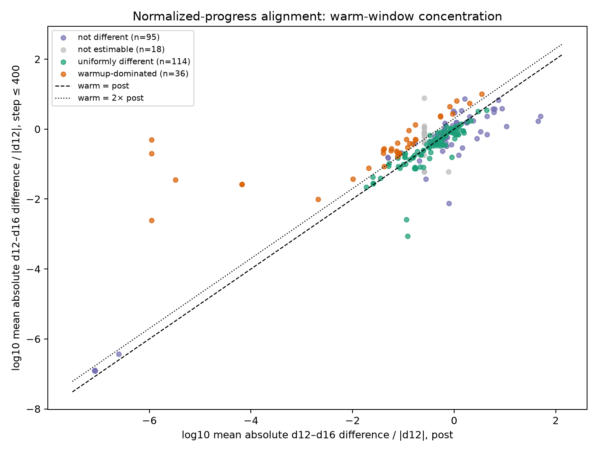
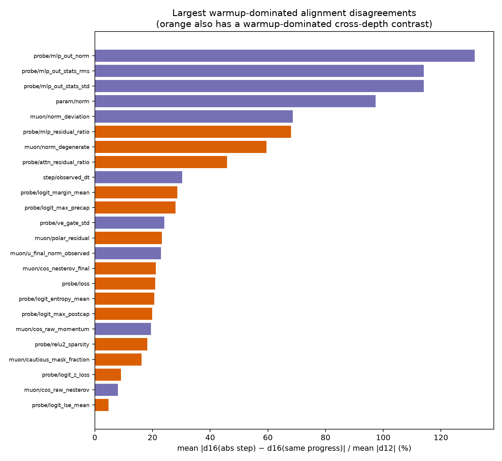
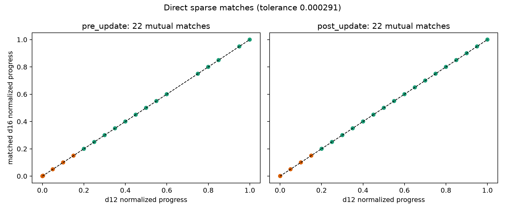

## Result

**The fixed-step schedules materially confound cross-scale comparisons.** Of 263 scalar metric-by-arm families, 42 are warmup-dominated under at least one of the two requested alignments and are therefore unsafe for unqualified depth/scale claims. Fourteen of those also have a warmup-dominated absolute-versus-progress alignment disagreement, which is the narrower set for which these data directly support schedule attribution.

The alignments do not merely change effect size; they change the family classification. Absolute-step alignment finds 10 warmup-dominated families, while normalized-progress alignment finds 36; only four overlap. The unsafe union is therefore 42, not 10 or 36.

### Decision rule and alignment

For each family and observation time I first took the median across repeated channels (layers, parameter roles, and probe variants). At each d12 time, the five d12 seeds then supplied the reference median, sample SD, and min/max band. The d16 effect in a window is the mean absolute deviation from the d12 median, divided by mean absolute d12 magnitude when a relative number is reported.

A difference is detectable when it exceeds **3 times the d12 seed SD**, the conservative end of I0001's 2--3x rule. A detectable warm-window effect is warmup-dominated when it is at least **2 times** the post-window relative effect. "Uniformly different" is the protocol's residual detectable category: detectable but not warmup-dominated; it does not assert a mathematically constant offset. Fewer than two supported time points in either window is reported as **not estimable**, rather than being forced into one of the three requested labels.

d12 supplies the anchors. Absolute alignment compares d16 at the same phase-adjusted recipe step. Progress alignment compares d16 at the same `normalized_progress`, so d12 step 400 corresponds to about d16 step 853. Continuous and periodic curves are linearly interpolated only inside observed support. Sparse curves are never interpolated: absolute matches require an identical recipe step, while progress matches must be mutual nearest neighbors within 0.000291 normalized-progress units (half of one d12 plus one d16 update).

| classification | absolute step | normalized progress | alignment disagreement |
|---|---:|---:|---:|
| warmup-dominated | 10 | 36 | 26 |
| uniformly different | 63 | 114 | 39 |
| not different | 34 | 95 | 42 |
| not estimable | 156 | 18 | 156 |
| **total** | **263** | **263** | **263** |

### Unsafe families

These are the 42 families warmup-dominated under at least one requested alignment.

Warmup-dominated under **both** alignments (4):

- `muon/norm_degenerate`
- `probe/logit_margin_mean`
- `probe/logit_max_postcap`
- `probe/logit_max_precap`

Warmup-dominated under **absolute step only** (6):

- `grad/zero_fraction`
- `muon/cautious_mask_fraction`
- `muon/polar_residual`
- `probe/logit_entropy_mean`
- `probe/logit_saturation_fraction`
- `probe/loss`

Warmup-dominated under **normalized progress only** (32):

- `calib/grad_norm`
- `curvature/e_lin_gradient [shadow_fp32]`
- `curvature/e_lin_update [native]`
- `curvature/e_sym_gradient [native]`
- `curvature/e_sym_gradient [shadow_fp32]`
- `curvature/e_sym_random [native]`
- `curvature/e_sym_update [shadow_fp32]`
- `curvature/fd_snr_random [native]`
- `curvature/fd_snr_random [shadow_fp32]`
- `curvature/fd_snr_update [native]`
- `curvature/shadow_verdict_code [shadow_fp32]`
- `curvature/verdict_code_gradient [shadow_fp32]`
- `curvature/vhv_random [native]`
- `curvature/vhv_random [shadow_fp32]`
- `curvature/vhv_update [native]`
- `curvature/vhv_update [shadow_fp32]`
- `muon/cos_data_decay`
- `muon/cos_nesterov_final`
- `muon/cos_raw_final`
- `muon/factored_scale_dispersion`
- `muon/replay_update_relerr`
- `optim/lr`
- `optim/lr_eff`
- `optim/momentum`
- `overhead/muon_reference`
- `probe/attn_residual_ratio`
- `probe/logit_lse_mean`
- `probe/logit_z_loss`
- `probe/mlp_residual_ratio`
- `probe/relu2_sparsity`
- `scalars/smear_lambda`
- `sketch/probe_grad_cosine_prev`

The 15 `curvature/*` entries above satisfy the frozen defined-row universe, but most are acceptance diagnostics or uncertified native-bf16 quantities. They are flags about analysis safety, not physical curvature claims. I0001 says only the shadow gradient direction has passing checkpoints; no native number is promoted here as a certified measurement.

### Families with direct alignment evidence

For the 14-family narrower subset, the warm-window absolute-versus-progress disagreement is a median **21.05% of d12 magnitude** (range 4.76--68.08%), versus a median **5.75%** after step 400 among families with a nonzero denominator. The warm disagreement is a median **12.4 d12-seed SDs** (minimum 3.3 SDs). These are not seed-scale fluctuations.

| family | alignment disagreement <=400 | post | d12-seed SD multiple <=400 | absolute class | progress class |
|---|---:|---:|---:|---|---|
| `probe/mlp_residual_ratio` | 68.08% | 19.35% | 12.9x | uniformly different | warmup-dominated |
| `muon/norm_degenerate` | 59.48% | n/a | infinity | warmup-dominated | warmup-dominated |
| `probe/attn_residual_ratio` | 45.81% | 14.12% | 7.9x | uniformly different | warmup-dominated |
| `probe/logit_margin_mean` | 28.66% | 7.49% | 13.4x | warmup-dominated | warmup-dominated |
| `probe/logit_max_precap` | 27.96% | 2.79% | 8.5x | warmup-dominated | warmup-dominated |
| `muon/polar_residual` | 23.26% | 2.49% | 15.5x | warmup-dominated | uniformly different |
| `muon/cos_nesterov_final` | 21.17% | 10.03% | 3.3x | uniformly different | warmup-dominated |
| `probe/loss` | 20.94% | 6.77% | 47.8x | warmup-dominated | uniformly different |
| `probe/logit_entropy_mean` | 20.66% | 6.56% | 12.4x | warmup-dominated | uniformly different |
| `probe/logit_max_postcap` | 19.91% | 0.06% | 76.9x | warmup-dominated | warmup-dominated |
| `probe/relu2_sparsity` | 18.23% | 2.66% | 7.5x | uniformly different | warmup-dominated |
| `muon/cautious_mask_fraction` | 16.18% | 5.75% | 25.0x | warmup-dominated | uniformly different |
| `probe/logit_z_loss` | 9.10% | 3.68% | 10.4x | uniformly different | warmup-dominated |
| `probe/logit_lse_mean` | 4.76% | 1.92% | 11.5x | uniformly different | warmup-dominated |

`muon/norm_degenerate` has a zero post-window baseline, so its relative post disagreement is undefined; its warm-window difference is exact against zero d12 seed spread.

### High-power reference channels

I0001 identifies training loss, probe loss, parameter norm, and Muon replay error as channels with useful seed power. They show why alignment must be part of any claim:

| family | absolute <=400 / post | progress <=400 / post | alignment disagreement <=400 / post | conclusion |
|---|---:|---:|---:|---|
| `loss/train_mean` | 2.37% / 1.95% | 14.77% / 7.87% | 12.40% / 6.73% | detectable in both windows; not 2x-dominated at the primary cutoff |
| `probe/loss` | 12.99% / 1.88% | 8.44% / 7.93% | 20.94% / 6.77% | unsafe; absolute warmup-dominated |
| `param/norm` | 33.95% / 62.43% | 115.86% / 70.78% | 97.36% / 22.84% | large persistent scale difference, not warmup-dominated |
| `muon/replay_update_relerr` | 6.22% / not matchable | 92.05% / 12.82% | 946.79% / not matchable | unsafe; progress warmup-dominated, sparse attribution incomplete |
| `muon/cos_raw_final` | 8.33% / 36.88% | 23.23% / 7.32% | 23.03% / 33.67% | unsafe under progress, but disagreement is not warmup-dominated |
| `optim/lr` | 0% / 53.85% | 2.65% / 0.0066% | 2.65% / 53.84% | schedule channel; alignment reverses where the difference lives |
| `optim/momentum` | 0% / 2.66% | 3.49% / 0.00033% | 3.49% / 2.66% | schedule channel; progress warmup-dominated |

The early d12 training-loss seed SD in this analysis is 0.73% of magnitude, larger than I0001's whole-run 0.06% canonical figure; after step 400 it is 0.07%. The pointwise five-seed band therefore makes the early test more conservative instead of importing the whole-run number blindly. `probe/loss`'s warm disagreement is 47.8 such local SDs, and `muon/replay_update_relerr`'s progress-aligned warm effect is 25.5 local SDs. These are the response channels with power to support the finding. Curvature entries do not carry comparable evidential weight.

### Sparse-checkpoint constraint

The deep schedule cannot support a complete pair of comparisons under both alignments.

- In absolute steps, d12 and d16 share 10 deep checkpoints through step 400 but **zero after step 400**. That is why 156 families, chiefly sparse plus one-shot offline families, are not estimable for the absolute-step three-way classification.
- In normalized progress, only 22 of the 30 d12 deep checkpoints have a direct mutual d16 match. Within the 13 d12 warm-window checkpoints, only 8 pre-update and 5 post-update matches survive. The explicit LR and momentum landmarks at steps 40 and 400 do **not** have normalized-progress matches.
- Periodic families have only four d12 anchors at or before step 400 and 21 afterward. They have only the initialization anchor inside the 40-step LR warmup, so periodic response channels cannot separately resolve the LR warmup from the 400-step momentum ramp.

Consequently, no sparse-family result can simultaneously use direct absolute matches both inside and after warmup. A cross-depth sparse analysis that interpolates through those gaps is making an additional modeling assumption, not using a matched checkpoint measurement.

The complete per-family results, including effect sizes, seed multiples, match counts, and all four classifications, are in `family_results.csv`. Direct sparse pairs are in `sparse_progress_matches.csv`; threshold sensitivity is in `sensitivity.csv`.

## Limitations

1. **This is the nanochat size ray, not depth causality.** Depth co-varies with width, head count, batch size, LR derivations, weight decay, and horizon (DATASET caveat 1). Every "depth" flag here means unsafe for a recipe-at-scale comparison, not that depth caused the value.
2. **The seed reference is d12 only.** I0001's spread may not transfer to d16. The five-seed band quantifies the d12 reference trajectory, while d16 has one run. I used the canonical sample SD and a conservative 3x rule; no d16 error bar exists.
3. **The primary post window includes normalized warmdown.** The recipe's warmdown begins at the d12 deep landmark 882 (35% progress), so absolute-step alignment later compares a warming-down d12 run with a pre-warmdown d16 run. Post-window alignment disagreement is therefore not attributable solely to the 40/400-step warmups. Restricting post to the plateau `(400, 882]` changes the unsafe count from 42 to 40 and the alignment-supported count from 14 to 18, with some membership changes. Primary results retain the frozen `>400` definition; the plateau result is a sensitivity analysis.
4. **The classification thresholds were not frozen.** The protocol froze the comparison but not a numerical decision rule, so this run is labeled exploratory. Holding 2x dominance fixed, a 2-SD detector gives 44 unsafe families versus 42 at 3 SD, and both give 14 alignment-supported families. Varying dominance is more consequential: 1.5x gives 54 unsafe / 21 supported, while 3x gives 28 / 8 at the 3-SD detector. The full grid is in `sensitivity.csv`.
5. **A fourth label was necessary.** The protocol requested three classes, but forcing one-shot offline totals or unmatched sparse families into them would manufacture a result. I report `not estimable` and retain every family in the universe. This is a disclosed deviation from the literal three-label output.
6. **Family medians hide within-family structure.** Collapsing layers, parameter roles, and probe variants by median makes unequal-depth row counts comparable but can miss layer-local effects. It is a family-level answer only.
7. **Interpolation is an assumption.** Continuous/periodic interpolation stays inside observed support, but nonlinear changes between periodic checkpoints are unresolved. Sparse rows are kept direct, which avoids that assumption at the cost of large non-estimable regions.
8. **The combined window cannot identify which warmup caused a response.** The primary `<=400` estimand deliberately combines the 40-step LR warmup and 400-step Muon ramp. Sparse cadence helps near the start but does not provide normalized matches at the transition landmarks; periodic cadence cannot isolate the first 40 steps.
9. **Curvature certification and instrument caveats apply.** Curvature is
   scoped to one 256-token sequence (DATASET caveat 4); Muon stage quantities
   are reference-frame measurements with 3--10% replay error (caveat 5);
   native bf16 curvature is uncertified everywhere (caveat 6); probe channels
   use one shared frozen sample (caveat 7); noise metrics are descriptive only
   (caveat 9). Curvature diagnostics were included because the frozen universe
   says all defined scalar families, not because they are strong response
   variables.
10. **Multiple comparisons and autocorrelation remain.** This is a 263-family
    search (DATASET caveat 10). Time points are highly correlated, so SD
    multiples are detector ratios, not independent-sample p-values. The result
    needs new runs with proportional warmups for confirmation.
