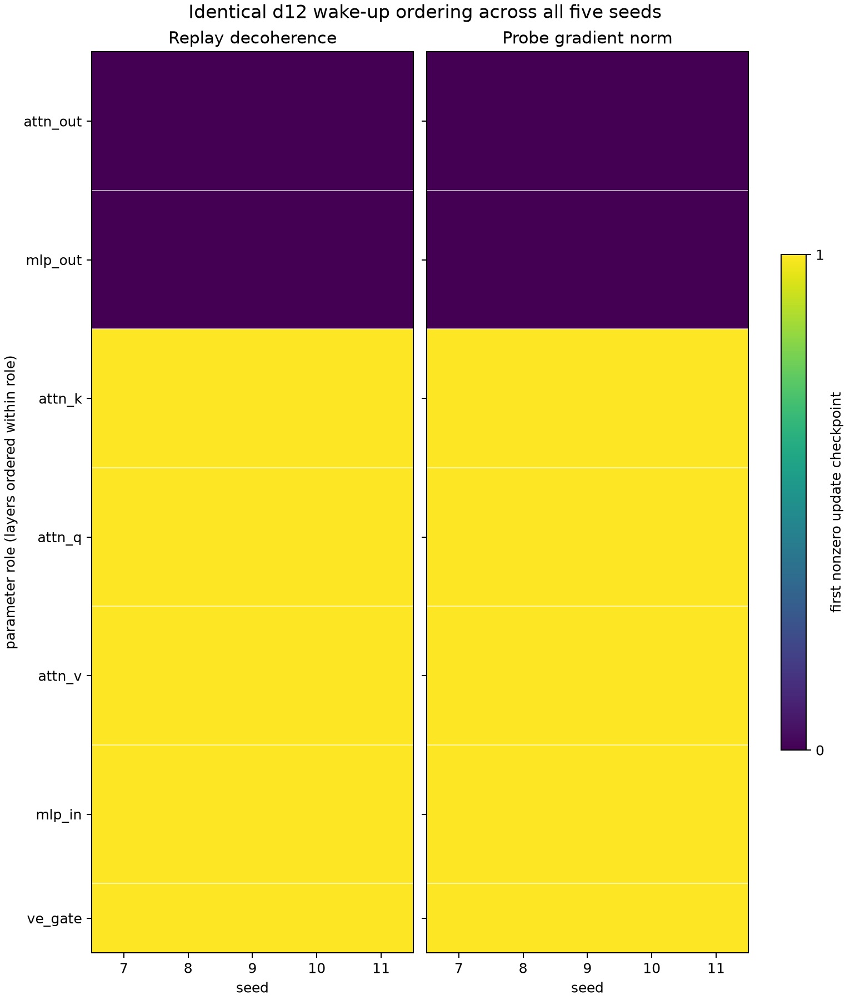
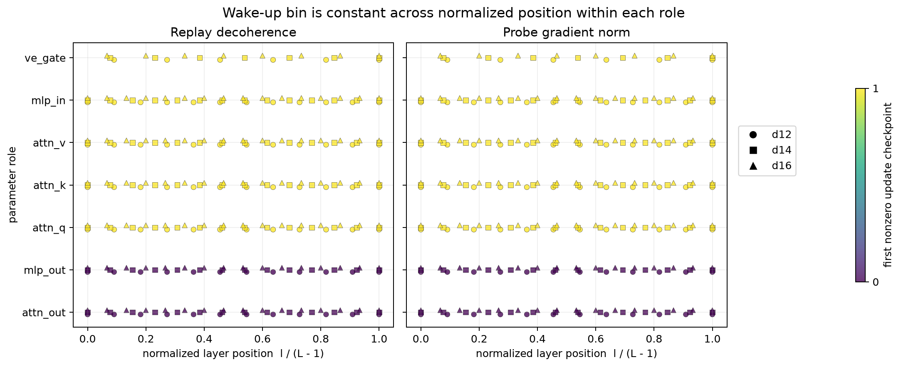

## Result

Wake-up is a two-bin, role-level event, not a layer-by-layer wave. At the
first-update checkpoint (update index 0), every attention and MLP output
projection is already nonzero in both replay decoherence and probe-gradient
norm. Every matrix upstream of those projections is exactly zero. At update
index 1, all upstream matrices are nonzero. There are no later wake-ups and no
observed returns to exact zero after wake-up.

| role | d12 matrices | d14 matrices | d16 matrices | first nonzero replay decoherence | first nonzero probe-gradient norm |
|---|---:|---:|---:|---:|---:|
| `attn_out` | 12 | 14 | 16 | 0 | 0 |
| `mlp_out` | 12 | 14 | 16 | 0 | 0 |
| `attn_q` | 12 | 14 | 16 | 1 | 1 |
| `attn_k` | 12 | 14 | 16 | 1 | 1 |
| `attn_v` | 12 | 14 | 16 | 1 | 1 |
| `mlp_in` | 12 | 14 | 16 | 1 | 1 |
| `ve_gate` | 6 | 7 | 8 | 1 | 1 |

This gives the same initial split at every depth: **54/78, 63/91, and
72/104 = 69.2308% exactly zero** for d12, d14, and d16 respectively. The
remaining 24, 28, and 32 matrices are the two output-projection families.
Every one of the 78, 91, and 104 matrices is nonzero by update 1. The two wake
clocks agree for all **585/585 run-by-matrix instances**.

### Exact-zero test

I filtered `is_defined == True` explicitly, required finite nonnegative
`value_scalar`, and classified zero with literal `value_scalar == 0.0`.
There was no tolerance, rounding, or `isclose`; signed zero would also count
as exact numeric zero (none of the zero rows had a negative sign bit). The
test covered **36,088 sparse scalar rows** (18,044 per wake channel), with
zero undefined relevant rows. For the gradient clock I used the stored
nonnegative squared norm; it is zero if and only if its norm is zero.

The distinction is consequential: the smallest nonzero probe-gradient
squared norm at update 1 is **1.7582e-17**, while the smallest nonzero replay
decoherence there is **0.0032297**. Both are awake under exact equality; no
threshold was applied. No channel was exactly zero at or after its recorded
wake checkpoint.

Sparse replay rows are `post_update` and label deep checkpoint *s* as
`step=s+1`; I subtracted one. Sparse probe gradients are `pre_update` and
already label the same checkpoint as `step=s`. Thus “0” and “1” in the table
are aligned update indices, not raw row labels.

### Stability across the five d12 seeds

The order is exactly stable, including its ties. All **78/78 matrices** have
the same wake bin in all five seeds for both clocks. Across the 10 seed pairs:

- matrix-wise exact agreement is **100%**;
- tie-aware Kendall **tau-b = 1.000** for every pair and both clocks;
- all **30,030/30,030** matrix-pair ordering relations per clock agree
  (including ties), and all **12,960/12,960** untied early-versus-late
  relations agree;
- the Jaccard index of the update-0 exact-zero sets is **1.000** for every
  seed pair.

I0001 reports a 3.5% sd-relative seed spread for the *amplitude* of
`muon/replay_update_relerr`. That amplitude error bar is not a tolerance for
an exact-zero state. The directly measured d12 wake-time spread is instead
**zero checkpoints**, and the d14/d16 role ordering differs from every d12
seed by zero checkpoints as well.

### Absolute step versus relative network position

For cross-depth comparison I normalized layer as
**`layer / (depth - 1)`**, so the first and last transformer layers are 0 and
1 at every depth. (`ve_gate` exists on odd layers only.) On the common seed-7
comparison there are 273 matrices. The rule “output projection wakes at 0;
all five upstream roles wake at 1” predicts both clocks for **273/273
matrices**. Within every one of the 21 depth-by-role groups, wake time has one
unique value across the full observed range of normalized layer positions.

The result therefore supports an **absolute-update, role-governed** event and
not a relative-position wave. The upstream wake remains update 1 even though
that is 0.03968%, 0.02660%, and 0.01860% of the d12, d14, and d16 horizons.
There is no evidence here for an additional layer-position ordering: all
layers within a role wake in the same checkpoint bin.

### Universe and artifacts

The full per-matrix wake table is [matrix_wakeup.csv](matrix_wakeup.csv).
Grouped results are in [role_wakeup_summary.csv](role_wakeup_summary.csv),
and all seed-pair calculations—including concordant, discordant, and tied
counts—are in [seed_order_agreement.csv](seed_order_agreement.csv).

I also audited every one of the 14 periodic Muon stage families: 8,190
run-by-matrix channels in addition to the 585 replay channels. Their cadence
overlaps the early deep schedule only at update 0; the next stage measurements
are updates 101 (d12), 151 (d14), and 216 (d16). I did not interpolate those
families into updates 1/2/4. The complete audit is
[muon_stage_cadence_audit.csv](muon_stage_cadence_audit.csv); machine-readable
headline values and segment identities are in [summary.json](summary.json).

## Limitations

- The protocol selection mentions Muon stage families at early deep
  checkpoints, but the schema-v3 segments store the 14 stage families on the
  periodic cadence, not the early deep cadence, except at update 0. Their
  wake-up order after update 0 is therefore unresolvable from this dataset.
  This analysis uses the checkpoint-resolved replay and probe-gradient
  channels and reports the cadence deviation rather than interpolating.
- The early per-matrix gradient channel is a squared norm from the frozen
  probe (`sketch/probe_grad_sq_norm`), not the training-batch `grad/norm`,
  whose periodic cadence also skips updates 1/2/4. Probe gradients match the
  replay wake bins exactly, but that does not establish identical
  training-batch gradient amplitudes.
- Exact zero is tested on the stored telemetry scalar, not by reopening the
  underlying gradient tensors; lineage checkpoint files are absent from the
  local dataset. The observed 0-to-1 transition itself is not interval
  censored because both consecutive checkpoints are present.
- This is a nanochat recipe size ray, not an isolated depth intervention:
  width, head count, batch size, learning rate, weight decay, and horizon
  co-vary. There are only three depths, and d14/d16 have one seed each. The
  five-seed d12 result cannot supply d14/d16 error bars.
- The 40-step LR warmup and 400-step Muon momentum ramp are absolute-step
  confounds. Both wake bins precede their endpoints, so the result is about
  the recipe's first two updates, not a general warmup-independent law.
- `muon/replay_update_relerr` is a reference-frame calibration channel, and
  its nonzero amplitude carries the dataset's roughly 3--10% per-matrix Muon
  replay caveat. The claim here concerns only stored exact-zero state and
  first-nonzero checkpoint, not the later decoherence magnitude.
