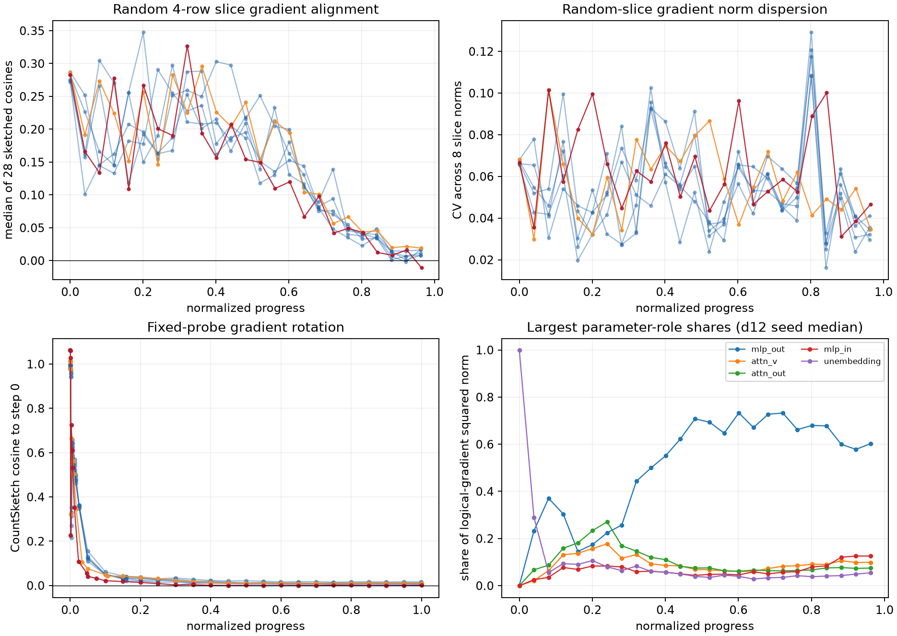
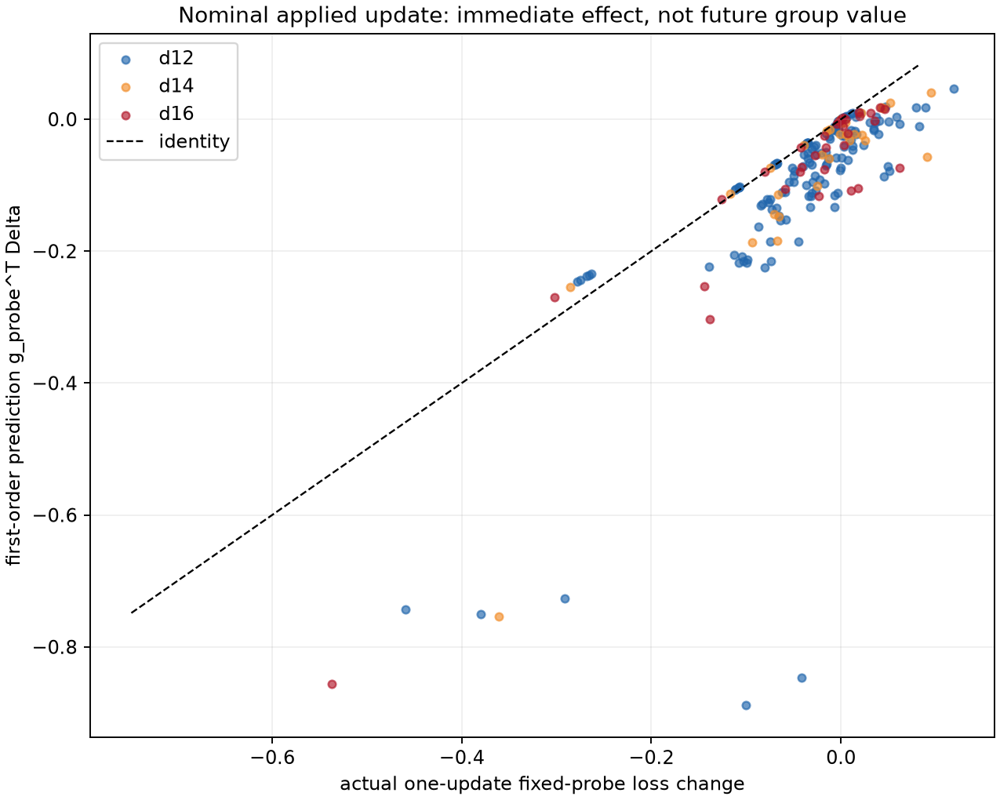

## Result

**The adaptive data-mixing hypothesis is not testable with this dataset.** No
record identifies a document, domain, source, crop, or other persistent data
group. Consequently there is no semantic `k`, no group-conditioned gradient
`g_k`, no group Hessian `H_k`, no group value target, and no realized or
counterfactual `q_k`. The data neither supports nor refutes the proposed
optimal-control model.

What the data does support is a narrower characterization of random sub-batch
and fixed-probe geometry. Those measurements show substantial changes during
training, but they must not be promoted to evidence about semantic group
usefulness.

### Feasibility mapping

| Theoretical quantity | What the dataset offers | Proxy quality | Precisely what it cannot do |
|---|---|---|---|
| `g_k(t)` | At each of 25 periodic events per run, the noise diagnostic splits one 32-row **device batch** into `K=8` contiguous random 4-row slices (8,192 tokens each) and computes each slice gradient. It persists each slice's exact squared norm and the 28 pairwise sketched cosines, but not the slice sketches/vectors. Separately, `sketch/grad` is the 4,096-bin CountSketch of the full logical-batch gradient, and `sketch/probe_grad` is the fixed 4×256 short-probe gradient. | Exact gradient norms for the wrong object; approximate geometry for randomly resampled slices; fixed probe is useful for parameter-motion studies. | No semantic or persistent group label, no reconstruction of any slice gradient vector, no tracking of a slice across time, no domain/source/crop identity, and no group-conditioned logical-batch gradient. |
| `‖g_k(t)‖` | `noise/per_sub_sq_norm` gives exact full-parameter norms of the eight random slice gradients. `noise/mean_grad_norm` and `grad/norm` give exact per-role/per-layer norms of the device-batch mean and applied logical-batch gradient respectively. Exact norms accompany each persisted gradient sketch. | High for random slices, fixed probe, and nominal mixture; none for semantic groups. | Cannot say which group's norm changed or compare persistent groups. The per-slice role norms calculated in memory are not persisted. |
| `g_i^T g_j` | The 28 random-slice CountSketch cosines plus exact slice norms yield approximate pairwise inner products. CountSketch has 4,096 bins and a fixed seed. | Useful description of within-device-batch data noise. Approximate and group-free. | No semantic `i,j`, no exact inner products, no raw slice sketches for alternative checks, and no repeated group pair over time. |
| `g_k^T g_nominal` | From the slice norms and pairwise cosines I derived each random slice's approximate dot product/cosine with the exact **same-device-batch** mean. This mean contains the slice itself. Raw fixed-probe and logical-gradient sketches are synchronous only at step 0, giving seven additional one-time cosines. | Weak, endogenous surrogate: the device mean is self-inclusive and covers only one eighth of the logical batch. The step-0 fixed probe is random data, not a group. | Cannot align a semantic `g_k` with a corpus/nominal gradient, cannot evaluate it throughout training, and cannot separate sampling from parameter motion. |
| `H_k(t)` | The HVP machinery applies the Hessian of one frozen 1×256 short-probe loss to random, fixed-probe-gradient, and actual-update directions. Stored shadow-fp32 outputs include `gHg`, `‖Hg‖`, `g-Hg` cosine, `dHd`, and directional curvature scalars. | Valid local curvature for the **fixed probe** only when its direction verdict passes. Of 215 shadow checkpoints, the gradient direction passed 186; random and update directions passed 0. | No group loss/Hessian, no dense Hessian, and no persisted `Hv` vector. The local checkpoint files needed to run new post-hoc HVP directions are absent from this copy. |
| Costate `λ(t)` | Nothing. The actual update `Δ`, a later fixed-probe gradient, and the current probe gradient are all recorded or sketched, but none is the adjoint of a declared final objective through the future optimizer trajectory. | None. | Cannot transport a terminal objective backward through Muon/AdamW state, stochastic future batches, or the discrete training dynamics. |
| `s_k(t)=λ^Tg_k` | Nothing group-indexed. `update/p1 = g_probe^TΔ` measures first-order **immediate** effect of the already chosen nominal update on the current fixed probe. | No proxy for `s_k`; `p1` is an informative but different contraction. | Cannot rank groups, estimate future/final usefulness, construct `q_k`, or validate the exponential policy. |
| `H_jg_i-H_ig_j` | Nothing. The implementation could apply an HVP to a chosen direction during a future run, but this dataset retains only scalar products/norms from one global fixed-probe Hessian. | None. | No `H_i`, `H_j`, `g_i`, `g_j`, HVP vectors, bracket vector/sketch, costate contraction, or response variable measuring later relative group value. |

### Data and tested proxy population

The exact segments were:

- `d12-s7-s0-6c217854f4174ce884dfb2b2dcc13c45`
- `d12-s8-s0-2b2e72e4395440029b92226213d137bb`
- `d12-s9-s0-b872e698e81b4a8fa0cd08512f43c2c2`
- `d12-s10-s0-0ffeb05742bb4154a3f1afc202dc3955`
- `d12-s11-s0-5fd1bf807f764954b30658872fc3e2ad`
- `d14-s7-s0-b72acf7ac59942dab902e26fa0b2c80d`
- `d16-s7-s0-8e0a39fc8f164343bd01ef6b915e849f`

The analysis covers 175 periodic noise events, 1,400 random-slice gradient
norms, 4,900 pairwise slice cosines, 1,400 derived slice-to-device-mean
alignments, 21,125 logical-gradient role/layer norm rows, 215 shadow-fp32
update-effectiveness checkpoints, and 645 per-direction shadow HVP verdicts.
`noise/b_noise` was defined at 173/175 events. Every undefined row was
explicitly excluded.

### 1. Random-slice geometry changes strongly, but it is not group value

The eight slices are newly sampled data at every checkpoint. Across all seven
runs, their median pairwise gradient cosine falls sharply while their norm
dispersion changes little:

| Normalized-progress phase | Events | Median event pair cosine | Median fraction of 28 pairs below zero | Median slice-norm CV | Median slice-to-device-mean cosine | Median `B_noise` |
|---|---:|---:|---:|---:|---:|---:|
| early, `<0.25` | 49 | 0.1925 | 0.000 | 0.0540 | 0.5517 | 16.7 |
| middle, `[0.25,0.75)` | 84 | 0.1846 | 0.000 | 0.0564 | 0.5323 | 17.5 |
| late, `>=0.75` | 42 | 0.0207 | 0.214 | 0.0449 | 0.3718 | 161.9 |

The Spearman correlation between progress and median pair cosine is negative
in every run, from -0.718 to -0.836. Across the five d12 seeds, the late-minus-
early median-cosine change is -0.167 with across-seed SD 0.021; all five
changes are negative. The d12 late/early `B_noise` ratio ranges from 9.98 to
13.17. That is far larger than I0001's 26% sd-relative seed spread for
`noise/b_noise`, although caveat 9 makes `B_noise` descriptive rather than a
critical-batch estimate.

Thus the directions of random sub-batch gradients become much less mutually
aligned late in training even though their magnitudes remain similarly
dispersed. This is real evidence about stochastic gradient noise. It is not
evidence that the relative usefulness of stable data groups changes: the
slice indices have no persistent meaning, and the self-inclusive device-batch
mean is not `g_nominal` for the logical batch or corpus.

### 2. Sketches show gradient rotation, with only one synchronous alignment

The fixed short-probe gradient CountSketch rotates rapidly away from its
initial direction. Median cosine to its step-0 sketch is 0.362 in the early
phase, 0.0111 in the middle, and 0.00957 late. Values this small are at the
rough `1/sqrt(4096) ≈ 0.016` sketch-error scale, so the supported statement is
that the late gradient is unresolved from orthogonal at this sketch
resolution—not that its exact cosine is 0.00957. Sketch collision error can
also produce values slightly above one; the observed maximum is 1.062.

Successive fixed-probe sketch cosine rises from a phase median of 0.705 early
to 0.955 late, indicating slower local rotation between adjacent deep
checkpoints. This phase comparison is partly confounded by the geometric
early deep schedule versus the nearly uniform tail schedule. Successive
logical-batch sketch cosine, measured at roughly uniform periodic cadence, is
near zero: phase medians are 0.045 early, -0.034 middle, and -0.064 late. It
conflates new batch data with parameter motion, as specified by the
instrument.

The fixed-probe and logical-gradient raw sketches share the same pre-update
step only at step 0. Their seven step-0 cosines range from 0.353 to 0.397
(median 0.374). There is therefore no gradient-probe/nominal alignment time
series to use as a `g_k^Tg_nominal` surrogate.

### 3. Parameter-role and layer decompositions localize the nominal gradient

These decompositions partition parameter coordinates, not data. In d12, the
median share of logical-gradient squared norm in `mlp_out` rises from 0.194
early to 0.635 late. The late-minus-early change is positive in every seed
(range +0.350 to +0.483). Among layer-indexed parameters, the upper third's
median share rises from 0.474 early to 0.729 late, while the lower third falls
from 0.240 to 0.113.

This shows that the location of nominal gradient energy changes substantially
during training. It cannot identify which data generated that energy or
which data would be preferable.

### 4. Certified HVP evidence exists only for the fixed-probe gradient

Shadow-fp32 per-direction verdicts over 215 checkpoints are:

| Direction | Passed | Inconclusive | Failed |
|---|---:|---:|---:|
| fixed-probe gradient | 186 | 27 | 2 |
| random | 0 | 211 | 4 |
| actual update | 0 | 214 | 1 |

On the 186 passing gradient-direction checkpoints, the median `g-Hg` cosine
is 0.493 early, 0.538 middle, and 0.538 late. Median `eta_star` falls from
0.536 early to 0.126 middle and 0.0793 late. These are certified properties of
one fixed short-probe loss, not `H_k`. I0001 reports d12 sd-relative spreads
of 29% for `gHg` and 25% for `eta_star`, so subtle curvature comparisons would
not be distinguishable with five seeds. No actual-update HVP passes its
directional suite, and no stored HVP is a vector that could be subtracted to
form a bracket.

### 5. Update effectiveness supports an immediate nominal-update surrogate

For the shadow-fp32 fixed-probe surface, the actual one-update loss change is
defined at all 215 deep checkpoints. It improves the probe (`actual < 0`) at
137/215 checkpoints (63.7%), with median relative improvement
`-actual/loss_before = 0.446%`. This paired one-step effect is about 2.8 times
I0001's 0.16% sd-relative `probe/loss` seed spread, near the reference's
two-to-three-SD detectability rule. It is still neither a future loss nor a
group-specific intervention.

The first-order term `p1=g_probe^TΔ` has the correct sign at 172/215
checkpoints (80.0%), median normalized absolute error 54.8%, and median
within-run Spearman correlation 0.733 with relative immediate benefit (range
0.691–0.816 across seven runs). Gradient norm, `g-Hg` cosine, `gHg`, and
update norm alone have median within-run Spearman correlations between -0.153
and 0.095; none consistently predicts even this weaker target.

The quadratic `p2` is descriptively much closer: 98.6% sign agreement, 2.44%
median normalized residual, and median within-run Spearman 0.991. However,
all 215 update-direction shadow HVP verdicts are non-passing, so this is an
**uncertified diagnostic**, not accepted curvature evidence. It also uses the
already chosen optimizer update rather than a candidate group gradient.

### Answers to the five questions

1. **Does relative usefulness of data groups change? — Unavailable.** Random
   slice alignment changes reproducibly, but the slices are newly sampled and
   unlabeled. There is no stable group or usefulness outcome.

2. **Can future usefulness of a group's gradient be estimated
   retrospectively? — Unavailable.** There is no `g_k`, costate, final-loss
   influence, common-future replay, or group intervention. The one-step
   fixed-probe effect of the nominal update is not a future group value.

3. **Which local quantities best predict future usefulness? — Partially
   supported for a weaker surrogate only.** For immediate nominal-update
   effect, `p1` is informative and uncertified `p2` is much closer than norm
   or scalar curvature alone. There is no response variable on which to rank
   predictors of future group usefulness.

4. **Is there evidence for noncommutativity? — Unavailable.** Neither side of
   `H_jg_i-H_ig_j` exists, no bracket or costate contraction can be computed,
   and there is no change in relative group value to predict.

5. **What is the smallest sufficient telemetry set? — Partially supported as
   engineering guidance, unavailable as an empirical feature-selection
   result.** Existing timing shows that gradient sketches are relatively
   cheap and full HVP acceptance is expensive. Sufficiency cannot be selected
   without group labels and a future-value target.

No answer is marked supported. The two partial answers concern feasibility or
a deliberately weaker one-step target, not the central hypothesis.

## Minimum instrumentation for a testable future run

Assume a preregistered taxonomy with `K=8` groups. The exact `K`, taxonomy,
terminal objective, horizons, and sampling policy must be frozen before the
run; otherwise group construction becomes an exploratory degree of freedom.

| Addition | Exact records and cadence | Estimated cost on this setup |
|---|---|---|
| Loader identity and realized mixture | Carry a stable source locator `(shard,row_group,row_index)` or content hash, `group_id`, original token length, crop flag, and packed-row segment spans through tokenization, best-fit reordering, and cropping. Every step, store per-group token/document/crop counts plus nominal `p_k` and realized `q_k`. Persist the full span sidecar for batches used at gradient/value checkpoints. | Counters for 8 groups using three int64 counts plus `p,q` are about 0.25 KiB/step, under 1.4 MiB raw for the 5,376-step d16 run. Store segment spans, not uint16 per-token group IDs: the latter would cost 1 MiB per 524,288-token logical batch and about 5.4 GiB over d16. Loader bookkeeping should be negligible but must be benchmarked for prefetch effects. |
| Group-conditioned gradients | At the existing 25-point periodic cadence, evaluate a frozen, balanced 4×256-token probe for every group at the same `theta_s`. Store probe/sample IDs, token count and loss normalization, exact full and per-role/layer norms, a 4,096-bin CountSketch of each `g_k`, schema hash/seed, and the exact norm/sketch of the `p_k`-weighted nominal gradient. | Eight sketches are 128 KiB/event and 3.1 MiB/run at 25 events, plus small norm tables. Eight current 4×256 probe-gradient evaluations are estimated at 0.6–0.9 training-step equivalents/event, bracketed by 8× the measured probe-sketch cost and the measured noise diagnostic (0.79–0.89 step equivalents). Total is roughly 15–23 step equivalents/run: 0.6–0.9% of d12 and 0.3–0.4% of d16. |
| Future-value target (gold standard) | At five normalized-progress anchors, checkpoint model, optimizer, RNG, and deterministic future batch identities. Fork `K+1` branches for a `W=32`-update horizon: the common baseline and one branch whose first logical batch shifts a frozen small mass `epsilon` from the nominal mixture toward group `k`, with token count fixed; the remaining 31 batches are common. Evaluate a frozen held-out terminal objective. Store `ΔPhi_k/epsilon`, its paired baseline, realized group counts, and branch hashes. This directly gives a finite-horizon ranking target for `s_k` without pretending an ordinary gradient is the costate. | `5×(K+1)×W = 1,440` update equivalents/run for `K=8`, about 57% of a d12 run or 27% of d16, offline and parallelizable. One full model+optimizer state is currently about 2.04/2.84/3.83 GB for d12/d14/d16, so five independent anchors cost about 10.2/14.2/19.1 GB before compression. This is the expensive indispensable part: observational telemetry alone cannot supply counterfactual value. |
| Explicit costate, if required | Declare `Phi`, retain exact batch/loader lineage between anchors, and differentiate the **discrete optimizer state transition** (parameters plus Muon/AdamW state) backward through each replay window. Store `‖lambda_s‖`, a 4,096-bin sketch, schema hash, and dot products with every stored `g_k`. Validate those dot products against the branch finite differences above. | Storage of each lambda sketch is only 16 KiB/anchor, but compute is at least a reverse/recomputed pass through each 32-step window and implementation complexity is high. The branch target should be built first; an unvalidated parameter-only Hessian adjoint would not be the costate of this optimizer. |
| Group Hessians and Lie brackets | At the same five anchors, on a frozen short group probe compute all 56 ordered cross-HVPs `H_j g_i`, form the 28 bracket vectors in memory, and store each bracket's norm and 4,096-bin sketch. Also store `lambda^T bracket` once a validated costate exists. Apply per-direction HVP acceptance; do not inherit a verdict from another group or direction. | Storing all 56 HVP sketches is 0.875 MiB/anchor, 4.4 MiB/run. On the existing 1×256 HVP probe, 56 HVPs are roughly the work of the recorded 150-forward-equivalent acceptance suite, or about 5–6 training-step equivalents/anchor; a 4-row curvature bank is approximately four times that. Acceptance tests add further cost. Benchmark before freezing cadence. |

A cheap screening tier may also store future/terminal validation-gradient
sketches and align historical `g_k` sketches with them. That is useful for
model development, but it must be labeled a terminal-gradient proxy, not
`lambda`. The branch experiment remains necessary to identify whether the
preferred mixture actually improves a future objective. Once a predictor is
chosen, its `q_k ∝ p_k exp(beta s_hat_k)` policy needs new multi-seed
intervention runs; this observational sweep cannot validate the policy.

## Limitations

- Dataset caveat 9 is decisive: the noise diagnostic covers one device batch,
  batch size never varies, and no loader sidecar exists.
- This is exploratory work over many available channels. Caveat 10 applies;
  the proxy findings need frozen confirmation on new runs.
- CountSketch inner products are approximate. The raw random-slice sketches
  and exact slice inner products were not persisted, so their error cannot be
  calibrated post hoc in these events.
- Probe quantities use the same frozen samples across the collection (caveat
  7). Their cross-seed comparisons contain no probe-selection variance, but
  remain local to those samples.
- The five d12 seeds provide the only seed reference. d14 and d16 each have
  one seed, and caveats 1–3 prohibit attributing differences to depth or
  transferring the d12 noise floor without qualification.
- All curvature is scoped to one 256-token sequence (caveat 4). Native bf16
  curvature was not used. Shadow-fp32 curvature was conditioned
  on the relevant per-direction verdict. The attractive quadratic update
  result remains explicitly uncertified because the update direction passed
  zero checkpoints.
- The local copy omits lineage checkpoint tensors. Even if they were present,
  post-hoc group analysis would still require the absent sidecar and group
  probes.
- Immediate fixed-probe update effectiveness is paired and measurable, but it
  is not later/final loss, a counterfactual group intervention, or a costate.

All tables and figures are generated by `analyze.py`; machine-readable
intermediates and the full numerical summary are in this A0002 directory.
