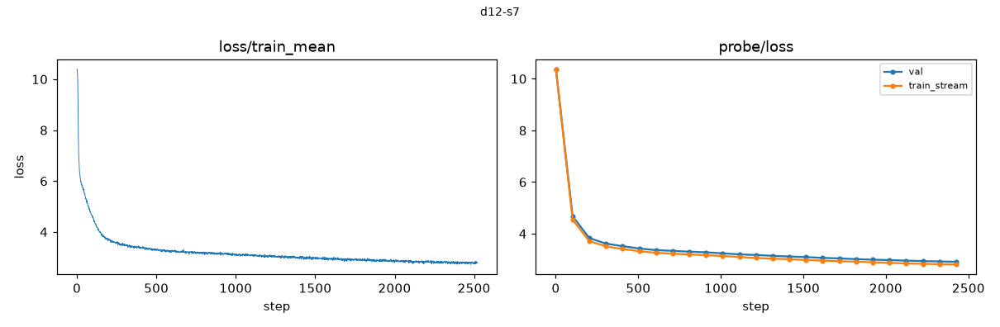

# Profile — d12-s7

## Inventory

- schema v3, seed 7, depth 12, width 768, heads 6
- 2520 steps; periodic every 101; 30 deep checkpoints
- backend fa3, compute dtype torch.bfloat16, shadow arm fp32
- lineage checkpoint labels: [0, 631, 1261, 1890]

| tier | rows | undefined | metric families |
|---|---|---|---|
| continuous | 194,094 | 0 | 32 |
| periodic | 82,387 | 737 | 118 |
| sparse | 15,483 | 432 | 118 |
| offline | 15 | 0 | 15 |

## Summaries

- train loss: 10.3976 at the first step, 2.7761 at the last (2,520 points)
- final probe loss, train_stream: 2.8063
- final probe loss, val: 2.9116
- telemetry overhead: 575.3 s total; update_effectiveness 156.4 s, shadow_acceptance 153.3 s, calibration 141.7 s, lineage_inventory 40.3 s, noise 21.9 s

### Acceptance verdicts

Checkpoint level (worst of the three probe directions):

- native: {'failed': 30}
- shadow_fp32: {'inconclusive': 30}

Per direction:

| arm | direction | verdicts |
|---|---|---|
| native | random | {'failed': 30} |
| native | gradient | {'failed': 30} |
| native | update | {'failed': 30} |
| shadow_fp32 | random | {'inconclusive': 30} |
| shadow_fp32 | gradient | {'inconclusive': 4, 'passed': 26} |
| shadow_fp32 | update | {'inconclusive': 30} |

## Data quality notes

- Undefined rows are present and carry reasons: 737 periodic, 432 sparse. They are honest 'not measurable here' records, not missing data.
- Every native (bf16) checkpoint verdict is `failed`. This is a property of bf16 arithmetic against fp32-era thresholds, documented in DATASET.md caveat 4. Native curvature values are not certified measurements.
- Shadow (IEEE fp32) checkpoint verdicts are the worst of three directions, so they understate what is usable; see the per-direction table above.
- Lineage checkpoint tensors (`checkpoints/*.pt`) are absent from this local copy by design; they remain on the GPU volume. Verification of their hashes is not possible here.
