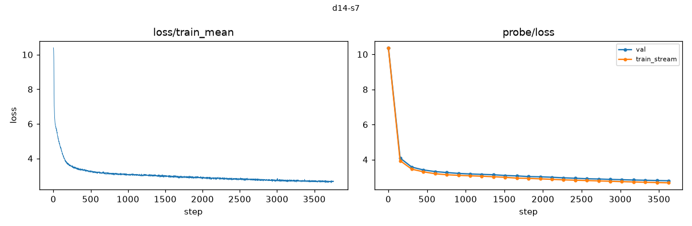

# Profile — d14-s7

## Inventory

- schema v3, seed 7, depth 14, width 896, heads 7
- 3759 steps; periodic every 151; 32 deep checkpoints
- backend fa3, compute dtype torch.bfloat16, shadow arm fp32
- lineage checkpoint labels: [0, 941, 1880, 2820]

| tier | rows | undefined | metric families |
|---|---|---|---|
| continuous | 289,499 | 0 | 32 |
| periodic | 95,246 | 855 | 118 |
| sparse | 18,083 | 489 | 118 |
| offline | 15 | 0 | 15 |

## Summaries

- train loss: 10.3974 at the first step, 2.6847 at the last (3,759 points)
- final probe loss, train_stream: 2.6805
- final probe loss, val: 2.7963
- telemetry overhead: 786.3 s total; update_effectiveness 205.8 s, shadow_acceptance 203.0 s, calibration 192.3 s, lineage_inventory 49.1 s, noise 28.3 s

### Acceptance verdicts

Checkpoint level (worst of the three probe directions):

- native: {'failed': 32}
- shadow_fp32: {'inconclusive': 30, 'failed': 2}

Per direction:

| arm | direction | verdicts |
|---|---|---|
| native | random | {'failed': 32} |
| native | gradient | {'failed': 32} |
| native | update | {'failed': 32} |
| shadow_fp32 | random | {'inconclusive': 30, 'failed': 2} |
| shadow_fp32 | gradient | {'inconclusive': 4, 'passed': 28} |
| shadow_fp32 | update | {'inconclusive': 32} |

## Data quality notes

- Undefined rows are present and carry reasons: 855 periodic, 489 sparse. They are honest 'not measurable here' records, not missing data.
- Every native (bf16) checkpoint verdict is `failed`. This is a property of bf16 arithmetic against fp32-era thresholds, documented in DATASET.md caveat 4. Native curvature values are not certified measurements.
- Shadow (IEEE fp32) checkpoint verdicts are the worst of three directions, so they understate what is usable; see the per-direction table above.
- Lineage checkpoint tensors (`checkpoints/*.pt`) are absent from this local copy by design; they remain on the GPU volume. Verification of their hashes is not possible here.
