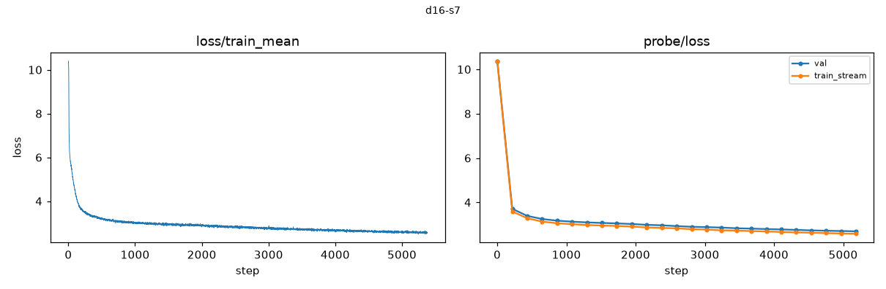

# Profile — d16-s7

## Inventory

- schema v3, seed 7, depth 16, width 1024, heads 8
- 5376 steps; periodic every 216; 33 deep checkpoints
- backend fa3, compute dtype torch.bfloat16, shadow arm fp32
- lineage checkpoint labels: [0, 1345, 2689, 4032]

| tier | rows | undefined | metric families |
|---|---|---|---|
| continuous | 414,009 | 0 | 32 |
| periodic | 108,105 | 974 | 118 |
| sparse | 20,265 | 504 | 118 |
| offline | 15 | 0 | 15 |

## Summaries

- train loss: 10.3974 at the first step, 2.5885 at the last (5,376 points)
- final probe loss, train_stream: 2.5855
- final probe loss, val: 2.6969
- telemetry overhead: 1039.6 s total; update_effectiveness 273.9 s, shadow_acceptance 269.4 s, calibration 263.0 s, lineage_inventory 64.7 s, noise 35.3 s

### Acceptance verdicts

Checkpoint level (worst of the three probe directions):

- native: {'failed': 33}
- shadow_fp32: {'inconclusive': 31, 'failed': 2}

Per direction:

| arm | direction | verdicts |
|---|---|---|
| native | random | {'failed': 33} |
| native | gradient | {'failed': 33} |
| native | update | {'failed': 33} |
| shadow_fp32 | random | {'inconclusive': 33} |
| shadow_fp32 | gradient | {'inconclusive': 2, 'failed': 2, 'passed': 29} |
| shadow_fp32 | update | {'inconclusive': 33} |

## Data quality notes

- Undefined rows are present and carry reasons: 974 periodic, 504 sparse. They are honest 'not measurable here' records, not missing data.
- Every native (bf16) checkpoint verdict is `failed`. This is a property of bf16 arithmetic against fp32-era thresholds, documented in DATASET.md caveat 4. Native curvature values are not certified measurements.
- Shadow (IEEE fp32) checkpoint verdicts are the worst of three directions, so they understate what is usable; see the per-direction table above.
- Lineage checkpoint tensors (`checkpoints/*.pt`) are absent from this local copy by design; they remain on the GPU volume. Verification of their hashes is not possible here.
